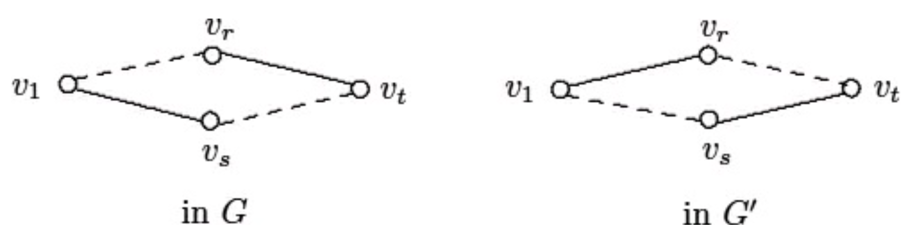

\newpage

# Chapter 1 Counting

## The Basics - Permutations, Combinations, and General Counting

### Permutation

**Definition - Permutation**: A **permutation** of an $n$-element set is an arrangement of the elements in a specific order

- $k$-permutation: arrangement of $k$ elements from the set
- The total number of $k$-permutation of an $n$-element set is
$$P(n, k) = \frac{n!}{(n-k)!} = n(n-1) \cdots (n-k + 1)$$

&nbsp;

**Example**: 10 people can run for office for a committee with a President, Vice President, and Treasurer. The total number of possible committees is $P(10, 3)$

&nbsp;

**Definition - $\mathbf{k}$th Falling Factorial of $\mathbf{n}$**: Let $n \geq k$, both positive integers. Then the **$\mathbf{k}$th Falling Factorial of $\mathbf{n}$** is $(n)_k = n(n-1) \cdots (n- k + 1)$

&nbsp;

**Example - Permutations with Repetitions**: How many rearrangements of $AAAABBBCCD$ are there?

- If we were only looking at distinct elements, there would be $10!$ factorial. However, the elements aren't distinct

As an example, look at how we can reorder the $A$'s
$$A_1 A_2 A_3 A_4 BBBCCD = A_2A_1A_3A_4BBBCCD = \cdots$$
Thus there are $4!$ of these representations that are equivalent and we divide $10!$ by $4!$ to account for this. Similar idea for the other letters

Thus the number of rearrangements is $\displaystyle \frac{10!}{4!3!2!1!}$

&nbsp;

**Theorem**: Suppose object $1$ occurs $a_1$ times, object $2$ occurs $a_2$ times, $\ldots$, object $k$ occurs $a_k$ times. Furthermore, suppose $a_1 + \cdots + a_k = n$

Then the total number of arrangements if $\displaystyle \frac{n!}{a_1 ! \cdots a_k!} = {n \choose a_1, a_2, \ldots, a_k}$

- **Definition - Multinomial Coefficients**: The notation above is called a multinomial coefficient

&nbsp;

### Combinations

**Definition - Combinations**: The total number of ways to create a $k$-element subset from $[n] = \{1, 2, \ldots, n\}$ is denoted
$${n \choose k} = \frac{n!}{k!(n-k)!} = \frac{P(n, k)}{k!}$$

- **Note**: the definition comes from $n!$ total possible distinct permutations of which we can permute a $k$-element subset $k!$ ways

&nbsp;

**Example**: There are $5$ cats, $5$ dogs, and $4$ mice. $3$ are chosen at once

- How many total number of ways  to get $2$ cats, $1$ dog?

  $\displaystyle {5 \choose 2} {5  \choose 1}$. This comes from choosing $2$ cats from $5$ cats, and then choosing $1$ dog from $5$ dogs

- How many total ways to get at least $1$ cat?

  $\displaystyle {14 \choose 3} - {9 \choose 3}$. This comes from subtracting the possible groupings with no cats from the total number of possible groupings

  $\displaystyle = {5 \choose 1}{9 \choose 2} + {5 \choose 2}{9 \choose 1} + {5 \choose 3}$. This comes from enumerating over possible groupings with 1 cat and 2 other animals, 2 cats and 1 other animal, and 3 cats and no other animals

&nbsp;

**Binomial Theorem**: If $n$ is a positive integer then
$$(x+y)^n = \sum_{k=0}^{n}{n \choose k}x^k y^{n-k}$$
*Proof*: $(x+y)^n = (x+y) \cdots (x+y)$

The coefficients of $x^k y^{n-k}$ is the product of $n$ terms distributing from $k$ $x$-terms and $n-k$ $y$-terms

So out of the $n$ terms that are multiplied together, ${n \choose k}$ contribute the $x$-term, leaving $n-k$ unused terms for $y$

Thus we have
$${n \choose k}x^k {n-k \choose n-k}y^{n-k} = {n \choose k} x^k y^{n-k}$$

&nbsp;

**Multinomial Theorem**: For $n \in Z^+$, we have
$$(x_1 + \cdots + x_k)^n = \sum_{\substack{a_1 + \cdots + a_k = n \\ a_1, \ldots, a_k \geq 0}}^{}{n \choose a_1, a_2, \ldots, a_k} x_1^{a_1} \cdots x_k^{a_k}$$

*Proof*: $(x_1 + \cdots x_k)^n = (x_1 + \cdots + x_k) \cdots (x_1 + \cdots + x_k)$

The coefficients of $x_1^{a_1} \cdots x_k^{a_k}$ is the product of $n$ terms resulting from a permutation with repetition of $a_1, \ldots, a_k$

Thus there are $\displaystyle {n \choose a_1, \ldots, a_k}$ distinct ways of representing the exponents of $x_1, \ldots, x_k$

&nbsp;

**Worksheet Examples**:

1.

   - How many strictly increasing 6-digit numbers are there (first digit can be 0)

      Since the numbers are strictly increasing, they numbers must be distinct

      Furthermore, there is only one possible way ordering of these selected digits (in increasing order), so order "doesn't matter"

      Thus we can just count the ways to select 6 digits: $\boxed{\displaystyle {10 \choose 6}}$

   - What about when the first digit cannot be zero?

      Since $0$ can only appear as the first digit, this is identical to the first question, but restricted to $\{1, \ldots, 9\}$

      $\boxed{\displaystyle {9 \choose 6}}$ ways

&nbsp;

2. A quiz has 5 problems with 3 different answers each. How many ways can the quiz be completed?

    $\boxed{3^5}$ ways

&nbsp;

3.

   - How many rearrangements of MISSISSIPPI are there?

      $\boxed{\displaystyle {11 \choose 4, 4, 2, 1}}$

   - How many rearrangements do not have all S's together?

      Treat all S's as one unit $\implies \displaystyle {8 \choose 4, 2, 1, 1}$

      Thus there are $\boxed{\displaystyle {11 \choose 4, 4, 2, 1} - \displaystyle {8 \choose 4, 2, 1, 1}}$ rearrangements

&nbsp;

4. Suppose each digit in a 5-digit code can have any number zero to nine

   - How many 5-digit codes are there with no restrictions?

      $\boxed{10^5}$

   - How many 5-digit codes have distinct digits?

      $\boxed{P(10, 5)}$

   - How many codes begin and end with an even number?

      $\boxed{5 * 10^4 * 5}$

   - How many 5-digit codes use exactly 2 different numbers?

      $\displaystyle {5 \choose 2}$ ways to choose two digits

      $2^5$ ways to write a five digit number using these two digits. However, we need to subtract the 2 cases where they use the same digit five times

      Thus answer is $\boxed{\displaystyle {5 \choose 2} (2^5 - 2)}$

&nbsp;

5. Consider a standard 52 card deck with 13 ranks and 4 suits

   - Probability of getting a full house (triple of the same rank, pair of another rank)

      $\boxed{\displaystyle \frac{\displaystyle {13 \choose 1}\displaystyle {4 \choose 3}\displaystyle {12 \choose 1}\displaystyle {4 \choose 2}}{\displaystyle {52 \choose 5}}}$

   - Probability of getting 2 pairs of different ranks and a 5th card of a different rank

      $\boxed{\displaystyle \frac{\displaystyle {13 \choose 2} \displaystyle {4 \choose 2} \displaystyle {4 \choose 2} *44}{\displaystyle {52 \choose 5}}}$

      Logic is to choose 2 types of ranks AT THE SAME TIME and then choosing possible pairs from those ranks. Finally multiply by $44$ (the remaining number of possible cards for the 5th card)

      &nbsp;

      **Note**: the answer below is NOT correct but is added to show an easy mistake to make

      $\displaystyle \frac{\displaystyle {13 \choose 1}\displaystyle {4 \choose 2}\displaystyle {12 \choose 1}\displaystyle {4 \choose 2} * 44}{\displaystyle {52 \choose 5}}$ is WRONG because we need to consider duplicate pairs (e.g. QQ, KK and KK, QQ)

      This solution ends up overcounting since we can choose Queens then Kings versus Kings then Queens, which yields the same hand

&nbsp;

6. $15$ people want to buy pre-made sandwiches. There are 7 H sandwiches, 4 C sandwiches, and 4 P sandwiches. If each person gets 1 sandwich, how many ways can the sandwiches be distributed?

    $\boxed{\displaystyle {15 \choose 7, 4, 4}}$

&nbsp;

7. 10 people are sitting at a circular table. How many seating arrangements are there?

    $\displaystyle \frac{10!}{10} = \boxed{9!}$

## Counting in 2 Ways

Given an equation, we count combinatorially in 2 ways

**Example**: $\displaystyle {n \choose k} = \displaystyle {n-1 \choose k} + \displaystyle {n-1 \choose k-1}$

LHS: chooses a $k$-size subset from $[n]$

RHS: Partitions subsets into 2 cases, containing element $1$ or not containing $1$

- Containing $1$: Pick $k-1$ elements from the remaining $n-1$ elements $\displaystyle {n - 1 \choose k - 1}$
- Not containing $1$: Pick $k$ from $n-1$ elements $\displaystyle {n-1 \choose k}$

Thus we have $\displaystyle {n \choose k} = \displaystyle {n-1 \choose k} + \displaystyle {n-1 \choose k-1}$

&nbsp;

**Example**: $\displaystyle \sum_{k = 0}^n k\displaystyle {n \choose k} = n2^{n-1}$

RHS: Picks 1 element to be the leader ($n$ choices)

Then from the remaining $n-1$ people, pick a subset ($2^{n-1}$ ways)

LHS: Picks a group of size $k$ ($\displaystyle {n \choose k}$ ways) and then select a leader amongst them ($k$ possible choices)

Thus $\displaystyle \sum_{k = 0}^{n} k \displaystyle {n \choose k} = n 2^{n-1}$

&nbsp;

**Example**: $\displaystyle \sum_{i=1}^{n}i (n - i + 1) = \displaystyle {n + 2 \choose 3}$

LHS: Let $a, b, c$ be numbers with $a < b< c$ from $[n+2]$. Fix $b = i + 1$ (the $i$th $+ 1$ element). Then there are $i$ choices for the element $a$ and $(n+ 2) - (i + 1) = n - i + 1$ choices for the element $c$

Thus the total ways to create a 3-size subset $\{a,b,c\}$ from $[n+2]$ is $\displaystyle \sum_{i=1}^{n} i(n-i+1) = \displaystyle {n+2 \choose 3}$

RHS: Counts the number of subsets of size $3$ from $[n+2]$

&nbsp;

**Example**: $\displaystyle {2n \choose n} = \sum_{k=0}^{n} \displaystyle {n \choose k}^2$

LHS: Count the number of size $n$ subsets of $[2n]$

RHS: Can be written as $\displaystyle \displaystyle {n \choose k} \displaystyle {n \choose n-k}$

So choose $k$ people from a group of size $n$ and $n-k$ people from another group of size $n$

Thus $\displaystyle \displaystyle {n \choose k} \displaystyle {n \choose n-k} = \displaystyle {2n \choose n}$

## Pigeon Hole Principle

**Theorem - Pigeon Hole Principle**: If $n+1$ pigeons are placed into $n$ pigeonholes, then there is at least one pigeonhole with at least $2$ pigeons

**Theorem - Generalized Pigeon Hole Principle**: If $n$ pigeons are placed into $k$ holes, then at least one hole has

- At most $\displaystyle \lfloor \frac{n-1}{k} \rfloor$ pigeons (round down)
- At least $\displaystyle \lceil \frac{n}{k} \rceil$ pigeons (round up)
- **Note**: the statements above are equivalent

*Proof*: Suppose all holes have $\displaystyle \leq \lfloor \frac{n-1}{k} \rfloor$ pigeons

Then there are at most $\displaystyle k \lfloor \frac{n-1}{k} \rfloor \leq n - 1 < n$ pigeons total. Which is a contradiction

&nbsp;

**Example**: Prove that in a group of 40 people, at least 4 people have a same birthday in the same month

40 pigeons and 12 holes $\implies \lceil \frac{40}{12} \rceil = 4$. Thus by PHP, the statement holds

&nbsp;

**Example**: Prove that if 6 distinct numbers are chosen from $[9]$, then 2 numbers will sum to 10

6 pigeons and 5 holes $(\{(1, 9), \ldots, (5, 5)\} \implies \lceil \frac{6}{5}\rceil = 2$. Thus by PHP, 2 of the numbers belong to the same pair and sum to 10

&nbsp;

**Example**; An athlete wants to work out 45 hours over a 30-day month and will work out at least 1 hour each day. Prove that there is a period of consecutive days such that the cumulative hours he has worked out is exactly 14

Let $a_i$ be the total hours accumulated up to day $i$

This creates a strictly increasing sequence $a_1, a_2, \ldots, a_{30} = 45$ where each $a_i$ is distinct

Define a new sequence $b_i = a_i + 14$

This creates a strictly increasing sequence $b_1, b_2, \ldots, b_{30} = 59$ where each $b_i$ is distinct

Since $\{a_i\}_{i=1}^{30}$ is distinct and $\{b_i\}_{i=1}^{30}$ is distinct (only within their own respective sequence), we can have at most $60$ possible values, which we treat as pigeons

Furthermore, $b_i$ can take on any of 59 distinct values, which we treat as the holes

Thus by PHP, some $a_j = b_k = a_k + 14$

Thus from day $k+1$ to day $j$, the total number of hours worked out is 14

## Compositions and Set Partitions

**Definition - Weak Composition**: Take $a_1, \ldots a_k \geq 0$ such that $\displaystyle \sum_{i=1}^{k} a_i = n$. Then the ordered $k$-tuple ($a_1, \ldots, a_k)$ is a **weak composition** of $n$ into $k$ partitions

- **Note**: This can be seen as distributing $n$ unlabeled balls into $k$ labeled boxes

&nbsp;

**Theorem - Stars and Bars**: The number of weak compositions of $n$ into $k$ parts is $\displaystyle {n + k - 1 \choose k - 1}$

*Proof*:

Denote the $n$ objects as stars. We model a distribution as follows:

Place $k$ bars where stars to the right of each bar is how many stars the corresponding part contains

**Note**: we must begin with a bar. Thus the rest involves $n$ stars and $k -1$ bars

Thus we can choose $k-1$ from these $n + k-1$ objects, resulting in $\displaystyle {n + k - 1 \choose k-1}$

Each one of these combination generates a different weak composition

&nbsp;

**Example**: How many ways can we distribute \$100 to 5 people?

- Can also be rephrased as how many non-negative integer solutions are there to $x_1 + \cdots + x_5 = 100$

Using the Stars and Bars Theorem, we have $\displaystyle {100 + 5 - 1 \choose 5 - 1} = \displaystyle {104 \choose 4}$ ways

&nbsp;

**Example**: Suppose we want to choose 3 lollipop flavors from 5 orange, 4 strawberry, and 3 grapes. How many ways can we choose 3 lollipops?

Here we want $x_O + x_S + x_G = 3$ where $x_O, x_S, x_G \geq 0$

Thus $\displaystyle {3 + 3 -1 \choose 3 - 1}$

&nbsp;

**Definition - Compositions**: Same as weak compositions but with the restriction that each $x_i \geq 1$

We can derive this with the formula above but ensuring that each of the $k$ boxes starts with 1 star, and then we distribute the remaining $n-k$ stars in a weak composition fashion. Thus the number of compositions of $n$ into $k$ parts is
$$\displaystyle {n - k + k - 1 \choose k - 1} = \displaystyle {n - 1 \choose k - 1}$$

**Note**: This problem is placing unlabeled balls into labeled bins

&nbsp;

**Definition - Partition**: Let $X$ be a finite set and $A_1, \ldots, A_k$ be non-empty subsets of $X$. Then a **partition** of $X$, $\{A_1, \ldots, A_k\}$ satisfies

- $\displaystyle \bigcup_{i=1}^k A_i = X$
- Each $A_i, A_j$ are pairwise disjoint

**Note**: This problem can be stated as: for a given $k$, $X$ is partitioned into $k$ **blocks**

&nbsp;

**Example**: $\{\{1, 2, 4\}, \{3, 5\}, \{6\}\}$ is a partition of $[6]$

The first inner set here can be considered placing balls $1, 2, 4$ into its own (unlabeled) bin

&nbsp;

**Definition - Stirling Number of the 2nd Kind**: The number of partitions of $[n]$ into $k$ **blocks**, denoted $S(n, k)$

- $S(0, 0) = 1$ by convention
- $S(n, 0) = 0$ for $n \geq 1$ is a partition of $[6]$

&nbsp;

**Example**: Use counting arguments to compute $S(n, 2)$

For each ball, we decide if it either it goes into block 1 or block 2, resulting in $2^n$

However, we require that each block has $\geq 1$ elements. Thus we need to subtract by $2$ for the cases where block 1 has all balls or block 2 has all balls by $2$ for the cases where block 1 has all balls or block 2 has all balls

Finally, we need to divide by 2 since the order of the blocks doesn't matter

$\displaystyle \frac{2^n - 2}{2}$

&nbsp;

**Theorem**: For $n \geq k$, we have
$$S(n, k) = S(n-1, k-1) + kS(n-1, k)$$

*Proof*:

LHS: Counts the number of ways to partition $[n]$ into $k$ blocks

RHS looks at partitions where

- $\{1\}$ is in its own bin. Then we need to partition $[n-1]$ into $k-1$ bins, resulting in $S(n-1, k-1)$
- $\{1\}$ is in a bin with other elements. Then we need to partition $[n-1]$ into $k$ bins, and then choose a bin to place $\{1\}$ into, resulting in $kS(n-1, k)$

**Theorem**: $S(n, k) = \displaystyle \frac{1}{k!} \sum_{i = 0}^k (-1)^i \displaystyle {k \choose i} (k-i)^n$

*Proof*: will show later

&nbsp;

**Definition - Bell Number**: Total number of partitions of $[n]$, denoted $B(n) = \displaystyle \sum_{k=1}^{n} S(n, k)$

- **Note**: $B(0) = 1$ by convention

&nbsp;

**Example**: Take $n=3$. Then we have
$$\{\{1, 2, 3\}\}, \{\{1\},\{2\},\{3\}\}, \{\{1\}, \{2, 3\}\}, \{\{2, \{1, 3\}\}\}, \{\{3\} \{1, 2\}\}$$
Thus $B(3) = 5$

&nbsp;

**Theorem**: $B(n) = \displaystyle \sum_{i=1}^{n}\displaystyle {n-1 \choose i-1} B(n-i)$

*Proof*:

LHS: counts the total number of partitions of $[n]$

RHS:

- Fix the $n$th element and determine the number of subsets of size $i$ that contain this element: $\displaystyle {n-1 \choose i-1}$ ways
- Partition the remaining $n-i$ elements: $B(n-i)$ ways

Thus we see that $B(n) = \displaystyle \sum_{i=1}^{n}\displaystyle {n-1 \choose i-1} B(n-i)$

&nbsp;

**Example**: Consider $f: A \rightarrow B$ where $|A| = n$ and $|B| = k$ for $n \geq k$. What is the total number of surjective functions?

- Recall that $f$ is surjective if for $\forall b \in B$, there exists at least one $a \in A$ such that $f(a) = b$

This problem can be viewed as partitioning $A$ into $\{A_1, \ldots, A_k\}$ and determining how they map to $B$, where $A_i = \{a \in A \mid f(a) = i\}$

Clearly the number of ways to partition $[n]$ into $k$ parts is $S(n, k)$

However, we also need to consider the order of the boxes (since they determine which subsets map to which values of $B$). Thus we need to multiply by $k!$

Thus the final answer is $k! S(n, k)$

## Integer Partitions

**Definition - Partition of Integer $\mathbf{n}$**: Positive sequence of integers $a_1, \ldots, a_k$, with $a_1 \geq a_2 \geq \cdots \geq a_k$ such that
$$a_1 + a_2 + \cdots + a_k = n$$
Total number of such sequences is denoted $p(n)$

- **Note**: Observe that since the values are non-increasing, the order "doesn't matter" so we don't need to distinguish $1 + 3 = 4$ from $3 + 1 = 4$
- **Note**: By convention, we have $p(0) = 1$

&nbsp;

**Example**: Take $n = 4$. Then we have
$$4 = 3 + 1 = 2 + 2 = 2 + 1 + 1 = 1 + 1 + 1 + 1$$
Thus $p(4) = 5$

&nbsp;

**Definition - Ferrers Diagram**: Represents a partition $(a_1, \ldots, a_k)$ by taking a partial rectangular grid with $k$ rows whose rows contain $a_i$ dots, such that $a_1 \geq \cdots \geq a_k$

&nbsp;

**Example**:

$$\young(~~~~,~~~,~,~,~)$$

This corresponds to $4 + 3 + 1 + 1 + 1= 10$

&nbsp;

**Definition - Conjugate of a Partition**: Diagram created by reflecting a Ferrers Diagram along the diagonal

- **Note**: Can be see as replacing columns as rows and rows as columns

&nbsp;

**Example**: Conjugate of the previous example

$$\young(~~~~~,~~,~~,~~,~)$$

This corresponds to $5 + 2 + 2 + 1 = 10$

&nbsp;

**Theorem**: Let $P_1$ denote the number of partitions where $a_1 = a_2 \geq a_3 \geq \cdots \geq a_k$ (for unfixed $k$). Let $P_2$ be the number of partitions whose smallest part is at least $2$. Then
$$P_1 = P_2$$

*Proof*: $\implies$ Take a partition where $a_1 = a_2$. Then take it's conjugate.

$$\young(~~~~~,~~~~~,~~,~~,~) \quad \quad \young(~~~~~,~~~~,~~,~~,~~)$$

Clearly every part of the conjugate has length $\geq 2$

Adding more dots to the original diagram doesn't affect the minimal lengths of the conjugate

Thus the conjugate assures each row has at least 2 dots $\implies$ each part has at least size $2$

$\impliedby$ Given a partition with $a_k \geq 2$, the conjugate creates a partition with $2$ rows that are the largest and have the same size. Thus $a_1 = a_2$ in the conjugate

&nbsp;

**Example**: Show that the total number of partitions of $n$ containing a part of size $1$ is $p(n-1)$

$\implies$ Take partition $P$ of $n$ containing a part of size $1$

This part will be the bottom row. Deleting that row yields $p(n-1)$

$\impliedby$ Given a partition $P_2$ of $n-1$, add a dot to the bottom. This yields a partition of $n$ with a part of size $1$

&nbsp;

**Definition - $\mathbf{p_k(n)}$**: Number of partitions of $n$ into exactly $k$ parts

&nbsp;

**Theorem**: For $1 < k < n$
$$p_k(n) = p_{k-1}(n-1) + p_k(n-k)$$
*Proof*:

LHS: counts the number of partitions of $n$ into $k$ parts

RHS:

- Count the number of partitions such that there is a partition of size $1$: $p_{k-1}(n-1)$
- Count the number of partitions such that every part has size $\geq 1$: $p_k(n-k)$

**Note**: Each part must have size $\geq 1$ by definition

## Twelvefold Way

Goal is to distribute $n$ (labeled or unlabeled) balls into $k$ (labeled or unlabeled) bins, depending on if the bins

- Have no restriction
- Have at least 1 ball
- Have at most 1 ball

This results in 12 possible scenarios

1. **$\mathbf{n}$ labeled Balls into $\mathbf{k}$ labeled Bins**

    - No restrictions: For each ball, pick a bin to put it into $\implies k^n$
    - At least 1: Can be viewed as the number of surjective functions $\implies k! S(n, k)$
    - At most 1:
      - If $n > k \implies 0$
      - Otherwise $n \leq k$ and we pick $n$ bins in a specific order $\implies P(k, n)$

2. **$\mathbf{n}$ Unlabeled Balls into $\mathbf{k}$ labeled Bins**

    - No restrictions: Weak composition $\implies \displaystyle {n+k-1 \choose k-1}$
    - At least 1: Composition $\implies \displaystyle {n-1 \choose k-1}$
    - At most 1:
      - If $n > k \implies 0$
      - Otherwise $n \leq k$ and we just need to choose $n$ bins to use $\implies \displaystyle {k \choose n}$

3. **$\mathbf{n}$ labeled Balls into $\mathbf{k}$ Unlabeled Bins**

    - No restrictions: Need to count all possible partitions with $0$ to $k$ parts $\implies \displaystyle \sum_{i=1}^{k}S(n, i)$
      - **Note**: This is NOT Bell's Number since we might have $k < n$
    - At least 1: Partition $[n]$ into $k$ parts $\implies$ $S(n, k)$
    - At most 1:
      - If $n > k \implies 0$
      - Otherwise $n \leq k$ and the bins are indistinguishable $\implies 1$ way

4. **$\mathbf{n}$ Unlabeled Balls into $\mathbf{k}$ Unlabeled Bins**

    - No restrictions: need to count all possible partitions with $0$ to $k$ parts $\implies \displaystyle \sum_{i=1}^{k}p_i(n)$
    - At least 1: Partition $n$ into $k$ parts $\implies p_k(n)$
    - At most 1:
      - If $n > k \implies 0$
      - Otherwise $n \leq k$ and the bins are indistinguishable $\implies 1$ way

&nbsp;

**Definition - Multiset**: Set of elements such that elements may repeat

&nbsp;

**Example**: How many multisets of size $5$ can be created using $[7]$?

Weak compositions for $1, 2, \ldots, 7$ such that the number of balls in each bin totals up to $5 \implies \displaystyle {5+7-1 \choose 7-1}$

&nbsp;

**Example**: How many injective functions $f: [n] \rightarrow [k]$ are there?

$n$ labeled balls into $k$ labeled bins where each big gets at most $1 \implies P(k, n)$

&nbsp;

**Example**: $20$ kids split into $4$ study groups. $2$ brothers must be in the same group and $2$ sisters must be in the same group. What is the total number of ways to split the kids

Treat the brothers and sisters each as one unit then partition $[18]$ into $4$ bins $\implies S(18, 4)$

## Inclusion-Exclusion Principle

**Theorem**: Let $A_1, \ldots, A_n \subseteq X$ where $X$ is finite and each $A_i$ is non-empty. Also let

- $I \subseteq [n]$
- $\displaystyle A_I = \bigcap_{i \in I} A_i$ with $A_{\emptyset} = X$

Then
$$\big| \bigcup_{i=1}^n A_i \big| = |X| - \displaystyle \sum_{I \subseteq [n]}^{} (-1)^{|I|} |A_I|$$

&nbsp;

**Note**: By De Morgan's Law, this is equivalent to

$$\displaystyle \big| \bigcap_{i = 1}^n \bar{A_i} \big| = |X| - \sum_{I \subseteq [n]}^{}(-1)^{|I|}|A_I|$$

&nbsp;

**Example**: For $n = 2 \implies I = \emptyset, \{1\}, \{2\}, \{1, 2\}$

\begin{align*}
\big| \bigcup_{i = 1}^2 A_i| &= |X| - \big((-1)^0 |X| + (-1)^1 |A_1| + (-1)^1 |A_2| + (-1)^2 |A_{\{1, 2\}}|\big) \\
&= |A_1| + |A_2| - |A_1 \cap A_2|
\end{align*}

&nbsp;

**Example**: How many integer solutions satisfy
$$x_1 + x_2 + x_3 = 35 \quad \quad \text{for } 0 \leq x_1, x_2, x_3, \leq 15$$

Consider the problem where $X_1 \geq 16$. We can place $16$ balls into the first bin then perform weak composition. We now use the negation form of the theorem above

Let $X$ be the set of all weak compositions. Now define

- $A_1 = \{\text{ weak compositions } \mid x_1 \geq 16\}$
- $A_2 = \{\text{ weak compositions } \mid x_2 \geq 16\}$
- $A_3 = \{\text{ weak compositions } \mid x_3 \geq 16\}$

Now we see that

\begin{align*}
\big| \bar{A_1} \cap \bar{A_2} \cap \bar{A_3} \big| &= \sum_{I \subseteq [3]}^{} (-1)^{|I|} |A_I| \\
&= \underbrace{{35 + 3 - 1 \choose 3 - 1}}_{I = \emptyset} - \underbrace{{3 \choose 1} {35 - 16 + 3 - 1 \choose 3 - 1}}_{I = \{1\}, \{2\}, \{3\}} + \underbrace{{3 \choose 2} \displaystyle {35 - 32 + 3 - 1 \choose 3 - 1}}_{I = \{1, 2\} \{1, 3\}, \{2, 3\}} - \underbrace{{3 \choose 3}(0)}_{\text{impossible since } 48 > 35}
\end{align*}

&nbsp;

**Example**: Count the total number of surjective functions $f: [n] \rightarrow [k]$, where $n \geq k$

Let $X$ be all functions from $[n] \rightarrow [k]$ and let $A_i$ be the set of functions that DO NOT map to $i \in [k]$. Then the total number of surjective functions is

\begin{align*}
\big| \bigcap_{i = 1}^k \bar{A_i}| &= \sum_{I \subseteq [k]}^{}(-1)^{|I|} |A_i|  \\
&= \sum_{i = 0}^{k} \displaystyle {k \choose i} (-1)^i (k-i)^n  \quad \quad \text{out of k, choose a set of image points not mapped to}\\
&= k!S(n, k)
\end{align*}

&nbsp;

**Example**: Consider the Euler Totient Function
$$\phi(n) = \big| \{i \in Z^+ \mid 1 \leq i \leq n, \gcd(i, n) = 1\} \big|$$

Let $p_1^{e_1} p_2^{e_2} \cdots p_t^{e_t}$, for $e_1 \geq 1$ be the prime factorization

Let $A_i = \{a \in [n] \mid p_1 \mid a\}$. Then we see value of $\phi(n)$ is

- Note $|A_1| = \frac{n}{p_1} \quad \quad$ how many numbers in $[n]$ have $2$ as a factor
- Note $|A_{\{1, 2\}}| = \frac{n}{p_1p_2} \quad \quad$ how many numbers in $[n]$ have $2$ AND $3$ as factors

\begin{align*}
\big| \bigcap_{i = 1}^t \bar{A_i} \big| &= \sum_{I \subseteq [t]} (-1)^{|I|}|A_I| \\
&= \underbrace{n}_{I = \emptyset} - \big(\frac{n}{p_1} + \frac{n}{p_2} + \cdots + \frac{n}{p_t} \big) + \big(\frac{n}{p_1p_2} + \frac{n}{p_2p_3} + \cdots \big) - \big( \frac{n}{p_1 p_2 p_3} + \cdots \big) + \cdots \\
&= n (1 - \sum_{i=1}^{t} \frac{1}{p_i} + \sum_{1 \leq i \leq j \leq t}^{} \frac{1}{p_i p_j} - \sum_{1 \leq i \leq j \leq k}^{} \frac{1}{p_i p_j p_k}) \\
&= n(1 - \frac{1}{p_1}) (1 - \frac{1}{p_2}) \cdots (1 - \frac{1}{p_t}) \\
&= n \prod_{i=1}^t (1 - \frac{1}{p_i})
\end{align*}

&nbsp;

**Example**: How many ways to seat 20 couples in a circular, unlabeled table with 40 seats such that each significant other doesn't sit with each other

Let $A_i$ be the set of seatings where couple $1$ is sitting next to each other. Then we see

\begin{align*}
\big| \bigcap_{i = 1}^{20} \bar{A_i} \big| &= \sum_{I \subseteq [20]}^{}(-1)^{|I|} |A_I| \\
&= \sum_{i = 0}^{20} \underbrace{20 \choose i}_{\mathclap{\text{select couples}}}  (-1)^i \underbrace{\frac{(40 - i)!}{40 - i}}_{\text{glue couples}}  \overbrace{2^i}^{\mathclap{{\text{order of couples}}}}
\end{align*}

# Chapter 2 Generating Functions

## Review of Power Series

**Definition - Formal Power Series**: For a sequence $\{a_n\}_{n \geq 0}$, the **Formal Power Series**

$$F(x) = \sum_{n = 0}^{\infty}a_n x^n$$

is the **Ordinary Generating Function** of $\{a_n\}_{n \geq 0}$

&nbsp;

**Example**: Let $\{a_n\}$ be given by

$$\frac{1}{2!}, \frac{1}{3!}, \ldots$$

Then the generating function is

\begin{align*}
F(x) &= \frac{1}{2!} + \frac{1}{3!}x + \frac{1}{4!}x^2 + \cdots\\
&= \frac{1}{x^2}( \frac{1}{2!} x^2 + \frac{1}{3!}x^3 + \cdots )\\
&= \frac{1}{x^2} \sum_{n = 2}^{\infty} \frac{x^n}{n!} \\
&= \frac{1}{x^2}(e^x - x - 1)
\end{align*}

&nbsp;

Same principle came be applied to find a sequence $\{a_n\}_{n \geq 0}$ given an OGF $F(x)$

**Example**: Find the sequence $\{a_n\}$ corresponding to

$$F(x) = \sum_{n = 0}^{\infty}a_n x^n = \frac{-4x + 3}{(1-x)(1 -2x)}$$

Using partial fractions we see

$$\frac{A}{1-x} + \frac{B}{1-2x} = -4x + 3 = A(1-2x) + B(1-x) \implies A = 1, B = 2$$

Thus we see that

\begin{align*}
F(x) &= \frac{-4x + 3}{(1-x)(1-2x)} \\
&= \frac{1}{1-x} + \frac{2}{1- 2x}\\
&= \sum_{n=0}^{\infty}x^n + \underbrace{2\sum_{n=0}^{\infty}(2x)^n}_{\sum_{}^{} 2^{n+1}x^n}\\
&= \sum_{n=0}^{\infty} (1+2^{n+1})x^n
\end{align*}

Thus $\{a_n\}_{n \geq 0} = \{1 + 2^{n+1}\}$

&nbsp;

### OGF's and Recurrences

We can replace $a_n$ with recursions for OGFs $\sum a_n x^n$

**Example**: Consider codes of length $n$ using A, B, C, D

Let $a_n$ be the total codes containing an even number of A's

1. Find a recurrence for $a_n$ in terms of $a_{n-1}$

    $a_n = 3a_{n-1} + 4^{n-1} - a_{n-1}$

    This comes from

    - Code doesn't end in A $\implies a_n = 3a_{n-1}$ (there are $3$ possible letters for the last letter)
    - Code ends in A $\implies 4n^{n-1} - a_{n-1}$ (All codes of length $n-1$ minus codes of length $n-1$ with an even number of A)

2. Find the OGF for $\{a_n\}$

\begin{align*}
f(x) &= \sum_{n=0}^{\infty}a_n x^n = \underbrace{1}_{a_0} + \sum_{n=1}^{\infty}a_n x^n \\
&= 1 + \sum_{n=1}^{\infty}(2a_{n-1} + 4^{n-1})x^n \\
&= 1 + \sum_{n=1}^{\infty}2a_{n-1} x^n + \sum_{n=1}^{\infty}4^{n-1}x^n \\
&= 1 + 2x \underbrace{\sum_{n=1}^{\infty} a_{n-1} x^{n-1}}_{f(x)} + x\underbrace{\sum_{n=1}^{\infty}(4x)^{n-1}}_{\text{geometric sum}}\\
&= 1 + 2x(f(x)) + x(\frac{1}{1-4x})\\
\end{align*}

&nbsp; &nbsp; &nbsp; &nbsp; Thus $\displaystyle f(x) = \frac{1}{1-2x} + \frac{x}{(1-2x)(1-4x)}$

3. Find the closed form of $a_n$

    By partial fractions, we have

\begin{align*}
f(x) &= \frac{1}{1-2x} + \frac{-1}{2(1-2x)} + \frac{1}{2(1-4x)}\\
&= \frac{1}{2}(\sum_{n = 0}^{\infty} (2x)^n) + \frac{1}{2} \sum_{n=0}^{\infty} (4x)^n\\
&= \sum_{n=0}^{\infty}\underbrace{(\frac{2^n}{2} + \frac{4^n}{2})}_{a_n}x^n
\end{align*}

&nbsp; &nbsp; &nbsp; &nbsp; Thus we have $\{a_n\} = \displaystyle \{2^{n-1} + \frac{4^n}{2}\}$

## OGFs and Counting

Using $\displaystyle \frac{1}{1-x} = \sum_{n=0}^{\infty} x^n$, we can differentiate to get

\begin{align*}
\frac{1}{(1-x)^2} &= \sum_{n=1}^{\infty}n x^{n-1}  = 1 + 2x + \cdots = \sum_{n= 0}^{\infty}(n+1)x^n \\
\frac{2}{(1-x)^3} &= \sum_{n=2}^{\infty}n(n-1) x^{n-2}  = 1 + 2x + \cdots = \sum_{n= 0}^{\infty}(n+2)(n+1)x^n \\
&\cdots \\
\frac{m!}{(1-x)^{m+1}} &= \sum_{n=0}^{\infty} \underbrace{(n+m)(n+m-1) \cdots (n+1)}_{(n+m)_m} x^n = \sum_{n=0}^{\infty} \frac{(n+m)!}{n!}x^n\\
\end{align*}

Thus we have

$$\frac{1}{(1-x)^{m+1}} = \sum_{n=0}^{\infty} \frac{(n+m)!}{n!m!}x^n = \sum_{n= 0}^{\infty} \displaystyle {n+m \choose m}x^n$$

For a fixed $m$, we have

$$\frac{1}{(1-x)^{m+1}} \iff \{a_n\} \quad \quad a_n = \displaystyle {n+m \choose m}$$

Which is the OGF for weak compositions into $m+1$ bins.

However, we can now interpret

$$\frac{1}{(1-x)^k} = \underbrace{(\frac{1}{1-x})(\frac{1}{1-x}) \cdots}_{\text{apply geometric series k times}} = (1 + x + x^2 + \cdots + \cdots) (1 + x + x^2 + \cdots + \cdots) \cdots$$

Consider the question of getting coefficients of $x^7$. This corresponds to the weak compositions of $7$ unlabeled balls into $k$ bins

However, now the chosen exponents correspond to the bin sizes. Thus we see that the OGF for weak compositions is

$$F(x) = \frac{1}{(1-x)^k} = \sum_{n=0}^{\infty}a_n x^n = \sum_{n=0}^{\infty}\displaystyle {n+k-1 \choose k-1}x^n$$

To obtain coefficients of $x^n$, contributions come from $x^{n_1}$ from group 1, $x^{n_2}$ from group 2, etc. such that

$$x^{n_1} x^{n_2} \cdots x^{n_k} = x^n \implies n_1 + n_2 + \cdots + n_k = n \quad \quad n_i \geq 0$$

&nbsp;

**Example**: 5 apple, 4 pear, and 6 orange lollipops. Find the OGF that would yield the total ways to get 5 lollipops. State the term that we want

$$F(x) = \underbrace{(1 + x + \cdots+ x^5)}_{\text{apples}}\underbrace{(1 + x + x^4)}_{\text{pears}} \underbrace{(1 + x + \cdots + x^6)}_{\text{oranges}}$$

We want coefficients of $x^5$ in $F(x)$.

&nbsp;

**Theorem**: Let $k$ be a fixed positive integer. Then the OGF for Stirling Numbers $S(n, k)$ is

$$F_k(x) = \sum_{n=0}^{\infty}a_nx^n = \frac{x^k}{(1-x)(1-2x) \cdots (1-kx)}$$

*Proof*: Note that

$$S(0, 0) = 1 \quad \quad S(n, 0) = 0 \quad \quad S(0, k) = 0$$

Also recall the recurrence

$$S(n, k) = S(n-1, k-1) + kS(n -1, k)$$

Then we see that

\begin{align*}
F_k(x) = \sum_{n=0}^{\infty}S(n, k)x^n &= 0 + \sum_{n=1}^{\infty}\Big(S(n-1, k-1) + kS(n-1, k)\Big)x^n \\
&= \Big(x\sum_{n=1}^{\infty}S(n-1, k-1)x^{n-1}\Big) + \Big( kx \sum_{n=1}^{\infty}S(n-1, k) x^{n-1}\Big) \\
&= xF_{k-1}(x) + kxF_k(x)
\end{align*}

Thus $\displaystyle F_k(x) = \frac{x}{(1-kx)}F_{k-1}(x)$

Finally, applying the above equation recursively, we see that

\begin{align*}
F_k(x) = \frac{x}{1-kx} \frac{x}{1-(k-1)x} F_{k-2} &= \cdots \\
&= \frac{x^k}{(1-x)(1-2x) \cdots (1-kx)}
\end{align*}

Thus the OGF is

$$\prod_{t=1}^k \frac{x}{(1-tx)} \quad \longleftrightarrow \quad \{S(n, k)\}$$

&nbsp;

**Theorem**: Let $p(n)$ denote the total partitions of an integer $n$. Then the OGF for $p(n)$ is

$$F(x) = \sum_{n=0}^{\infty}p(n)x^n = \frac{1}{(1-x)(1-x^2) \cdots} = \prod_{k=1}^\infty \frac{1}{1-x^k}$$

*Proof*:

\begin{align*}
F(x) &= \frac{1}{1-x} \frac{1}{1-x^2}\frac{1}{1-x^3} \cdots \\ \\
&= \underbrace{(1 + x + x^2 + x^3 + \cdots)}_{\text{how many 1's}} \underbrace{(1 + x^2 + x^4 + x^6 + \cdots)}_{\text{how many 2's}}\underbrace{(1 + x^3 + x^6 + x^9 + \cdots)}_{\text{how many 3's}} \cdots\\ \\
&= \prod_{k=1}^\infty (1 + x^k + x^{2k} + \cdots)
\end{align*}

&nbsp;

**Consider**: How many combinations of $x^n$ are there?

For $x^{m(k) * k}$, $m(k)$ is the total number of k's in the partition. For example, $m(1)$ is the total 1's in the partition

All possible contributions of $x^n$ is exactly the total partitions of integer $n$

&nbsp;

**Example**: Given an unlimited number of pennies, nickels, dimes, quarters, and half dollars, find the OGF that would count the total ways to make $\$1$. What is the coefficient?

We want coefficients of $x^{100}$ where

\begin{align*}
F(x) = \underbrace{(1 + x + \cdots + x^{100})}_{\text{number of pennies}} \underbrace{(1 + x^5 + \cdots + x^{100})}_{\text{number of nickels}}\underbrace{(1 + x^{10} + \cdots + x^{100})}_{\text{number of dimes}}\underbrace{(1 + x^{25} + \cdots + x^{100})}_{\text{number of quarters}}\underbrace{(1 + x^{50} + x^{100})}_{\text{number of half dollars}} \\
\end{align*}

Expanding (done on computer) yields $292x^{100} \implies 292$ ways

&nbsp;

**Theorem**: Total ways to partition $n$ into distinct parts equals the total ways to partition $n$ into odd sized parts

*Prof*: Distinct parts OGF is

\begin{align*}
F(x) &= (1 + x) (1 + x^2) + \cdots \quad \quad \text{this comes from each number only appears once}\\
&= (\frac{1 - x^2}{1 - x})(\frac{1 - x^4}{1 - x^2}) \cdots \\
&= (\frac{1}{1-x})(\frac{1}{1-x^3})(\frac{1}{1-x^5}) \cdots \\
&= (1 + x + x^2 + \cdots) (1 + x^3 + x^6 + \cdots)
\end{align*}

From above, we see that the even terms get cancelled and we are only left with the odd terms

Thus number of ways to partition $n$ into distinct parts equals the total number of ways to partition $n$ into odd sized parts

&nbsp;

**Theorem**: OGF for $p_k(n)$, the total number of partitions into exactly $k$ parts is

$$F(x) = \sum_{n=0}^{\infty}p_k(n)x^n = \frac{x^k}{(1-x) (1-x^2) \cdots (1-x^k)} = (1 + x + x^2 + \cdots) (1 + x^2 + x^4 + \cdots) \cdots (x^k + x^{2k} + \cdots)$$

*Proof*: Consider the OGF

$$F(x) = \frac{1}{(1-x) (1-x^2) \cdots (1-x^k)} = (1 + x + x^2 + \cdots) (1 + x^2 + x^4 + \cdots) \cdots (1 + x^k + x^{2k} + \cdots)$$

This counts the number of partitions of $n$ where each part has size at most $k$

Looking at the Ferrer Diagram of this, we see that each row can have at most $k$ dots

Thus the conjugate will have columns of size at most $k$, which establishes a bijection between counting the total partitions of $n$ with at most $k$ part

To manipulate this into an OGF for $p_k(n)$, we need a exactly $k$ rows in the conjugate, and thus need a part of exactly size $k$ in the original diagram

Thus we can create a new OGF that enforces an $x^k$ term

$$F(x) = \frac{x^k}{(1-x)(1-x^2) \cdots (1-x^k)}= (1 + x + x^2 + \cdots)(1 + x^2 + x^4 + \cdots) \cdots (x^k + x^{2k} + \cdots)$$

## Exponential Generating Functions

**Definition - EGF**: Function for a sequence $\{a_n\}$

$$G(x) = \sum_{n=0}^{\infty}a_n \frac{x^n}{n!}$$

Recall that for OGFs $A(x) = \sum_{}^{}a_n x^n$ and $B(x) = \sum_{}^{} b_n x^n$, we have that

$$A(x)B(x) = \sum_{n=0}^{\infty}c_nx^n \quad \quad c_n = \sum_{i=0}^{n}a_ib_{n-i} \implies \sum_{n=0}^{\infty}c_n x^n = (a_0b_0) + (a_0b_1 + a_1 b_0)x + (a_0b_2 + a_1b_1 + a_2 b_0)x^2 + \cdots$$

&nbsp;

**Lemma**: For OGFs $\displaystyle F(x) = \sum_{}^{}\overline{a_n}\frac{x^n}{n!}$ and $\displaystyle G(x) = \sum_{}^{}\overline{b_n} \frac{x^n}{n!}$, we have that

$$F(x)G(x) = \sum_{n=0}^{\infty}\overline{c_n} \frac{x^n}{n!} \quad \quad \overline{c_n} = \sum_{i=0}^{n} \displaystyle {n \choose i} \overline{a_i} \overline{b_{n-i}}$$

*Proof*: let $\displaystyle a_n = \frac{\overline{a_n}}{n!}$ and $\displaystyle b_n = \frac{\overline{b_n}}{n!}$. Then we have

$$F(x)G(x) = \sum_{n=0}^{\infty}c_n x^n \quad \quad c_n = \sum_{i=0}^{n}a_i b_{n-i} = \frac{1}{n!} \sum_{i=0}^{n} \displaystyle {n \choose i} \overline{a_i} \overline{b_{n-1}}$$

This last part is apparent from

\begin{align*}
c_n &= \sum_{i=0}^{n} \frac{\overline{a_i}}{i!} \frac{\overline{b_{n-i}}}{(n-i)!} \\
&= \frac{1}{n!} \sum_{i=0}^{n} \frac{n!}{i!(n-i)!}\overline{a_i} \overline{b_{n-i}} \\
&= \frac{1}{n!} \sum_{i=0}^{n} \displaystyle {n \choose i} \overline{a_i} \overline{b_{n-i}}
\end{align*}

&nbsp;

**Example**: Find the EGF of $\{P(n, k)\}$

For a fixed $m$ and using the Binomial Theorem, recall that the OGF for $(1 + x)^m$ is

$$(1+ x)^m = \sum_{n=0}^{\infty}\displaystyle {m \choose n} x^n = \sum_{n=0}^{\infty} \frac{m!}{n!(m-n)!}x^n$$

Thus this gives

$$\sum_{n=0}^{\infty}\frac{m!}{(m-n)!} \frac{x^n}{n!} = \sum_{n=0}^{\infty} P(m, n) \frac{x^n}{n!}$$

Thus the EGF of $\{P(m, n)\}$ is $(1 + x)^m$

&nbsp;

**Example**: For a fixed $k$ the EGF for $\{k^n\}$ is
$$\sum_{n=0}^{\infty}k^n \frac{x^n}{n!} = \sum_{n=0}^{\infty}\frac{(kx)^n}{n!} = e^{kx}$$

&nbsp;

**Theorem**: For a fixed $k$, the EGF for Stirling Numbers $S(n, k)$ is
$$G(x) = \sum_{n=0}^{\infty} S(n, k) \frac{x^n}{n!} = \frac{(e^x - 1)^k}{k!}$$

&nbsp;

**Corollary**: Recall that $\displaystyle B(n) = \sum_{k=0}^{n}S(n, k)$. Then the EGF of $B(n)$ is

$$G(x) = \sum_{n=0}^{\infty}B(n) \frac{x^n}{n!} = e^{(e^x - 1)}$$

*Proof*: We know that
$$G(x) = \sum_{n=0}^{\infty}\Big(\sum_{k=0}^{\infty}S(n, k)\Big) \frac{x^n}{n!}$$

- **Note**: If $n < k$, then $S(n, k) = 0$

Applying the previous theorem, we see that

\begin{align*}
G(x) &= \sum_{n=0}^{\infty}\Big(\sum_{k=0}^{\infty}S(n, k)\Big) \frac{x^n}{n!} \\
&= \sum_{k=0}^{\infty} \frac{1}{k!}(e^x - 1)^k\\
&= e^{(e^x - 1)} \quad \quad \quad \text{Note}: e^x = \sum_{n=0}^{\infty} \frac{x^n}{n!}
\end{align*}

&nbsp;

**Consider**: The EGF of permutations with repetitions of A, B, and C with quantities $S_1, S_2, S_3$

$$\Big(\sum_{\substack{S_1 + S_2 + S_3 = n \\ S_1, S_2, S_3 \geq 0}}^{}\frac{n!}{S_1! S_2! S_3!} \Big)\frac{x^n}{n!}$$

What is the coefficient of all possible permutations of length $n$ using A, B, C?

Combinatorically, we know that this is $3^n$. Thus we see that the EGF is

$$G(x) = \sum_{n=0}^{\infty}3^n \frac{x^n}{n!} = e^{3x}$$

&nbsp;

**Example**: Find the EGF that counts the total number of permutations of length $n$ containing an odd number of As, even number of Bs, and any number of Cs. Then find a closed form for the value

\begin{align*}
&\underbrace{(x + \frac{x^3}{3!} + \frac{x^5}{5!} + \cdots)}_{\text{A}} \underbrace{(1 + \frac{x^2}{2!} + \cdots)}_{\text{B}} \underbrace{(1 + x + \frac{x^2}{2!} + \cdots)}_{\text{C}} \\
&= \Big((1 + x + \frac{x^2}{2!} + \cdots) - (1 - x + \frac{(-x)^2}{2!} + \frac{(-x)^3}{3!} + \cdots)\Big) / 2 \\
& \quad \quad * \Big((1 + x + \frac{x^2}{2!} + \cdots) - (1 - x + \frac{(-x)^2}{2!} + \frac{(-x)^3}{3!} + \cdots)\Big) / 2 \\
& \quad \quad * \Big(1 + x + \frac{x^2}{2!} + \cdots \Big) / 2 \\
&= \Big(\frac{e^x - e^{-x}}{2}\Big)\Big(\frac{e^x + e^{-x}}{2}\Big)\Big(e^x\Big) \\
&= \frac{e^{3x} - e^{-x}}{4} \\
&= \frac{1}{4} \Big(\sum_{n=0}^{\infty} \frac{(3x)^n}{n!} - \sum_{n=0}^{\infty} \frac{(-x)^n}{n!}\Big) \\
&= \sum_{n=0}^{\infty} \frac{(3^n - (-1)^n)}{4} \frac{x^n}{n!}
\end{align*}

&nbsp;

**Consider**: What about multiplying other functions besides $e^x$

Recall that if $\displaystyle F(x) = \sum_{n=0}^{\infty}\overline{a_n} \frac{x^n}{n!}, \displaystyle G(x) = \sum_{n=0}^{\infty}\overline{b_n} \frac{x^n}{n!}$, the product had coefficients

$$\overline{c_n} = \sum_{i = 0}^{n} \displaystyle {n \choose i} \overline{a_i} \overline{b_{n-i}}$$

This can be seen as separating $[n]$ into 2 blocks and assigning group 1 to do something in $\overline{a_i}$ ways and the other $n-i$ people to do something in $\overline{b_{n-i}}$ ways

&nbsp;

**Example**: Find EGF and closed form $a_n$ that counts total permutations of length $n$ using A, B, C, D where the total number of A, B used is odd

EGF using odd numbers A, B in total is

$$G(x) = 2 \frac{x}{1!} + 2^3 \frac{x^3}{3!} + \cdots = \sum_{k=0}^{\infty}\frac{(2x)^{2k+1}}{(2k+1)!} = \frac{e^{2x} - e^{-2x}}{2}$$

EGF for permutations of C, D (with no restriction)

$$H(x) = (1 + 1 \frac{x}{1} + 1 \frac{x^2}{2!})(1 + 1 \frac{x}{1} + 1 \frac{x^2}{2!}) = e^x e^x$$

Thus closed from EGF for total permutations is $\displaystyle \frac{e^{2x} - e^{-2x}}{2} e^x e^x = \frac{e^{4x} - 1}{2}$

To find a closed for total ways $a_n$, we have

\begin{align*}
\frac{1}{2} (e^{4x} - 1) &= \frac{1}{2}\sum_{n=1}^{\infty} \frac{(4x)^n}{n!} \\
&= \sum_{n=1}^{\infty} \frac{1}{2}4^n \frac{x^n}{n!}
\end{align*}

Thus $a_n = \frac{1}{2}4^n$

For a counting argument, for each good permutation, we can swap A, C to get a bad permutation or swap B, D to get a bad permutation. Thus exactly half of the permutations are good

&nbsp;

**Example**: Place $n$ distinct books into $3$ bookshelves. What is the total number of ways to arrange the books such that each shelf has $\geq 1$ book?

Counting argument: Look at all $n!$ permutations of books then split them into $3$ bins $\implies n! \displaystyle {n-1 \choose 3-1}$

EGF argument: Let $a_i$ be the total number of ways to place $i$ books into shelf 1. Here $a_i = i!$

Thus for a single shelf, the EGF is $\displaystyle \sum_{i=1}^{\infty} a_i \frac{x^i}{i!} = \sum_{i=1}^{\infty}x^i$

To answer the original problem, we want coefficients of $\frac{x^n}{n!}$ in

\begin{align*}
(\sum_{i=1}^{\infty}x^i)^3 &= (\frac{1}{1-x} - 1)^3 \\
&= (\frac{x}{1-x})^3 \\
&= x^3 \sum_{j=0}^{\infty}\underbrace{\displaystyle {j+3-1 \choose 3-1}}_{\mathclap{\text{weak comp into 3 parts OGF}}}x^j \\
&= \sum_{j=0}^{\infty}\displaystyle {j + 3 - 1 \choose 3 - 1}x^{j+3} \\
&= \sum_{n=3}^{\infty}\displaystyle {n-1 \choose 3-1}x^n \\
&= \sum_{n=3}^{\infty}n! \displaystyle {n-1 \choose 2} \frac{x^n}{n!}
\end{align*}

Thus the coefficients for the EGF is $n! \displaystyle {n-1 \choose 2}$

&nbsp;

**Example**: EGF of $D_n$ Derangements of $f: [n] \rightarrow [n]$

Let $D(x)$ be the EGF for $D_n$

$$D(x) = \sum_{n=0}^{\infty} D_n \frac{x^n}{n!}$$

Consider the EGF for all bijections where $f(i) = i$: $\displaystyle \sum_{n=0}^\infty 1 \frac{x^n}{n!} = e^x$ (only one way)

Now consider $D(x)e^x = (D_0 + D_1 x + D_2 \frac{x^2}{2!} + \cdots ) (1 + x + \frac{x^2}{2!} + \cdots)$

- The coefficients of $\frac{x^n}{n!}$ is $\displaystyle \sum_{n=0}^{n} \displaystyle {n \choose i} D_i b_{n-i}$ (choose $i$ to derange and $n-i$ to fix)

- This counts all possible bijections

Thus EGF of all bijections is

$$F(x) = \sum_{n=0}^{\infty}n! \frac{x^n}{n!} = \sum_{n=0}^{\infty}x^n = \frac{1}{1-x}$$

Thus $\displaystyle \frac{1}{1-x} = D(x)e^x \implies D(x) = e^{-x} \frac{1}{1-x}$

To get the sequence $a_n$ we have

\begin{align*}
D(x) &= e^{-x}\frac{1}{1-x} \\
&= (\sum_{j=0}^{\infty}(-1)^j \frac{x^j}{j!}) (\sum_{i=0}^{\infty} x^i) \\
&= \sum_{n=0}^{\infty} \Big(\sum_{k=0}^{\infty} \frac{(-1)^k}{k!}\Big)x^n \\
&= \sum_{n=0}^{\infty} \Big(n! \sum_{k=0}^{n} \frac{(-1)^k}{k!} \Big) \frac{x^n}{n!}
\end{align*}

Thus the EGF is $\displaystyle n! \sum_{k=0}^{n}\frac{(-1)^k}{k!} = D_n$

&nbsp;

**Example**: How many ways can $\geq 1$ people be split into any number of non-empty groups such that each group sits at an unlabeled circular table

EGF for $1$ table with $n$ people is
\begin{align*}
G(x) &= \sum_{n=1}^{\infty} a_n \frac{x^n}{n!} \\
&= \sum_{n=1}^{\infty}(n-1)! \frac{x^n}{n!} \\
&= \sum_{n=1}^{n} \frac{x^n}{n}\\
&= \sum_{n=0}^{\infty} \frac{x^{n+1}}{n+1} \\
&= \int \sum_{x=0}^{\infty}x^n \\
&= \int \frac{1}{1-x} \, dx \\
&= \ln(\frac{1}{1-x})
\end{align*}

Thus EGF for $k$ tables is

&nbsp;

$\displaystyle \frac{\ln(\frac{1}{1-x})\ln(\frac{1}{1-x}) \cdots \ln(\frac{1}{1-x})}{k!}$ (need to consider overcounting since tables are unlabeled)

For any number of tables, we need to sum over $k$ and want the coefficient of $\displaystyle \frac{x^n}{n!}$

$$\sum_{k=0}^{\infty} \frac{(\ln(\frac{1}{1-x}))^k}{k!} = e^{\ln(\frac{1}{1-x})} = \frac{1}{1-x} = \sum_{n=0}^{\infty} x^n$$

Thus we see that

$$\sum_{n=0}^{\infty}x^n = \sum_{n=0}^{\infty}n! \frac{x^n}{n!}$$

Thus there are $n!$ ways to split $n$ people into any number of tables

&nbsp;

### Compositions of EGF

We want to partition $[n]$ into nonempty blocks and do task $1$ to each block, then task $2$ to the set of blocks

If $F(x)$ and $G(x)$ are the EGFs for each respective task, provided $\displaystyle F(x) = \sum_{n=1}^{\infty} a_n \frac{x^n}{n!}$, the total number of ways to partition $[n]$ into any number of blocks with task 1 on each block and task 2 on the set of blocks is

$$H(x) = G(F(x)) = \sum_{n=0}^{\infty}h_n \frac{x^n}{n!}$$

&nbsp;

**Example**: What if $F(x), G(x)$ are trivial, i.e. total ways to partition $[n]$ such that each block is represented in 1 way and the set of blocks i seen in 1 way

\begin{align*}
F(x) &= \sum_{n=1}^{\infty} \frac{x^n}{n!} = e^x - 1 \\
G(x) &= \sum_{k=0}^{\infty} \frac{x^k}{k!} = e^x
\end{align*}

Thus we see that

$$H(x) = e^{e^x - 1}$$

&nbsp;

**Example**: Given $n$ people, count the ways to seat them at any number of tables where each table is served red or white wine

To seat $i$ people at a table, the EGF was

$$F(x) = \sum_{n=1}^{\infty} (i-1) \frac{x^i}{i!} = \ln(\frac{1}{1-x})$$

Now given $k$ tables, EGF for ways to serve red or white wine is

$$G(x) = \sum_{k=0}^{\infty}2^k \frac{x^k}{k!} = e^{2x}$$

Thus we see that

$$H(x) = G(F(x)) = e^{2\ln(\frac{1}{1-x})} = \frac{1}{(1-x)^2} = \frac{d}{dx}(\frac{1}{1-x}) = \frac{d}{dx}(\sum_{n=0}^{\infty}x^n) = \sum_{n=0}^{\infty} (n+1) x^n = \sum_{n=0}^{\infty}n!(n+1) \frac{x^n}{n!}$$

Thus there are $(n+1)!$ total ways

## Catalan Numbers

Given a $m \times n$ lattice, how many UP, RIGHT paths from $(0, 0)$ to $(m, n)$ are there?

- This requires $m + n$ total steps $\implies \displaystyle {n+m \choose m} = \displaystyle {n+m \choose n}$

&nbsp;

Now consider $n \times n$ case that don't cross the diagonal

Let $C_n$ be the total number of paths that don't cross the diagonal

Partition these into classes where the last time the diagonal is touched is $(i, i)$ for $0 \leq i \leq n - 1$

Once we hit $(i, i)$, we have $C_{n-i-1}$ paths left. Thus the total paths is

$$C_n = \sum_{i=0}^{n-1} C_i C_{n-i-1} \quad \quad c_0 = 1$$

Where $C_n$ is called the **Catalan Number**

&nbsp;

**Theorem**: The OGF for $C_n$ is

$$F(x) = \frac{1-\sqrt{1 - 4x}}{2x} = \sum_{n=0}^{\infty}C_n x^n \quad \quad C_n = \frac{\displaystyle {2n \choose n}}{n+1}$$

*Proof*:

\begin{align*}
F(x) &= \sum_{n=0}^{\infty}C_n x^n \\
&= 1 + \sum_{n=1}^{\infty}C_n x^n = 1 + \sum_{n=1}^{\infty} \Big(\sum_{i=0}^{n-1}C_i C_{n-i-1} \Big) x^n \\
&= 1 + x \sum_{n=1}^{\infty} \Big( \sum_{i=0}^{n-1}C_i C_{n-i-1}\Big)x^{n-1} \\
&= 1 + x(F(x))^2 \\
&= \frac{1 \pm \sqrt{1 - 4x}}{2x}
\end{align*}

For the algebra above, recall that for $\displaystyle f = \sum_{n=0}^\infty a_nx^n$ and $\displaystyle g = \sum_{n=0}^\infty b_nx^n$, we have

$$fg = \sum_{n=0}^\infty d_n x^n \quad \quad d_n = \sum_{i=0}^n a_i b_{n-i}$$

Thus we see that

$$fg = \sum_{n=1}^{\infty}d_{n-1} x^{n-1} \implies \sum_{i=0}^{n-1} C_i C_{n-i-1} = F(x)^2$$

Additional algebra shows that

$$F(x) = \frac{1 \pm \sqrt{1 - 4x}}{2x} = \sum_{n=0}^{\infty} \frac{\displaystyle {2n \choose n}}{n+1}x^n$$

&nbsp;

### Combinatoric Proof of Catalan Numbers

We know that the total number of UP/RIGHT paths to $(n, n)$ is $\displaystyle {2n \choose n}$. We now remove the bad paths

Observe that the first time we touch a bad diagonal (diagonal above main diagonal) is after $i$ RIGHTS and $i+1$ UPS

- This results in $n-i$ RIGHTs and $n-(i+1)$ UPs to reach $(n, n)$

We alter the remaining path after touching the bad diagonal by reflecting it over the bad diagonal (so all RIGHTs are now UPs)

Now beyond the diagonal, we go $n-i-1$ RIGHTs and $n-i$ UPs

Thus total RIGHTs is $i + (n- i - 1) = n - 1$ and total UPs is $i + 1 + (n - i) = n + 1$

Consider which paths to $(n-1, n+1)$ will touch the bad diagonal? All of them

Thus any bad path to $(n, n)$ that goes over the main diagonal corresponds to a path reaching $(n-1, n+1)$, establishing a bijection

$$\displaystyle {(n-1)+ n + 1 \choose n-1} = \displaystyle {2n \choose n-1}$$

Thus the total paths $(n, n)$ that don't go over the main diagonal is

$$\displaystyle {2n \choose n} - \displaystyle {2n \choose n-1} = \frac{\displaystyle {2n \choose n}}{n+1}$$

&nbsp;

**Example**: Total ways to correctly group $n$ pairs of parentheses

Treat $($ as RIGHT and $)$ as UP. Then we have the Catalan number $C_n$

&nbsp;

**Example**: Total number of binary trees with $n$ interval nodes and $n+1$ leaves is

&nbsp;

\begin{center}
  \begin{tikzpicture}
  \node[state, minimum size=1cm]            (root)                                        {root};
  \node[state, minimum size=2cm]            (left)                  [below left=of root]  {$C_i$};
  \node[state, minimum size=2cm]            (right)                 [below right=of root] {$C_{n-i-1}$};
  \draw (root) -- (left);
  \draw (root) -- (right);
  \end{tikzpicture}
\end{center}

&nbsp;

The root is ignored and we recurse over the subcases. Thus there are

$$C_i = \sum_{i=0}^{n-1}C_i C_{n-i-1}$$

total trees

&nbsp;

**Example**: Total ways to triangulate a regular (labeled) polygon with $n+2$ sides i.e. total ways to draw $n-1$ lines connecting 2 vertices such that no lines cross

To triangulate a polygon with $n+2$ sides, we create a triangle using the line joining vertex $n+1$ and $n+2$ as the base

Assume that these vertices join with a vertex $k$ for $1 \leq k \leq n$. This creates 2 sub-polygons

- Polygon formed by $n+2, 1, 2, \ldots, k \implies k+1$ vertices $\implies C_{k-1}$
- Polygon formed by $k, k+1, \ldots, n+1 \implies n-k+2$ vertices $\implies C_{n-k}$

Thus total number of triangulations is

$$\sum_{k=1}^{n}C_{k-1}C_{n-k} = \sum_{n=0}^{n}C_k C_{n-k-1} = C_n$$

# Chapter 3 Graph Theory

## Introduction to Graph Theory

**Definition - (Simple) Graph $\mathbf{G}$**: ordered pair $(V, E)$ where $V = V(G)$ is a set of **vertices** and $E= E(G)$ is a set of **edges** (2-size subsets of $V$)

&nbsp;

**Definition - Adjacent**: Two vertices $v_1, v_2 \in V$ are **adjacent** if $\{v_1, v_2\} \in E$, denoted as $v_1 \sim v_2$

&nbsp;

**Definition - Incident**: An edge $e = \{v_1, v_2\}$ is **incident** to a vertex $v$ if $v$ is one of the endpoints of $e$

&nbsp;

**Definition - Subgraph**: Graph $H$ with $V(H) \subseteq V(G)$ and $E(H) \subseteq E(G)$

- **Spanning Subgraph** if $V(H) = V(G)$
- **Vertex Induced Subgraph** if whenever $u, v \in V(H)$ and $u \sim v \in E(G)$, then $u \sim v  \in E(H)$
- **Subgraph Induced by $\mathbf{S}$** if $S = V(H) \subseteq V(G)$, denoted $G[S]$

&nbsp;

**Definition - Walk**: Sequence of vertices beginning at $u$ and ending at $v$ such that consecutive vertices are adjacent

- **Closed** if $u = v$
- **Length**: total edges traversed

&nbsp;

**Definition - Trail**: Walk with no edge traversed more than once

&nbsp;

**Definition - Path**: Walk with no vertex traversed more than once

- **Note**: path $\implies$ trail $\implies$ walk

&nbsp;

**Definition - Circuit**: Closed trail of length 3 or more

- **Cycle**: Circuit with only the first and last vertex repeated

  - **Even Cycle** if total edges traversed is even
  - **Odd Cycle** if total edges traversed is odd

&nbsp;

**Definition - Connected Graph**: Graph $G$ such that for any distinct vertices $u, v$ there is a path $uv$

&nbsp;

**Definition - Distance**: Minimum length of a path $uv$, denoted $d(u, v)$

&nbsp;

**Definition - Diameter**: Distance of the farthest apart vertices, denoted $\diam(G) = \max_{u, v \in V(G)} \{d(u, v)\}$

&nbsp;

**Definition - Path Graph**: Graph on $n$ vertices, denoted $P_n$, with edge set $E(P_n) = \{\{v_1, v_2\}, \{v_2, v_3\}, \ldots, \{v_{n-1}, v_n\}\}$

- **Note**: $P_n$ will have $n-1$ edges

&nbsp;

**Definition - Cycle Graph**: Graph on $n$ vertices, denoted $C_n$, with edge set $E(C_n) = \{\{v_1, v_2\}, \{v_2, v_3\}, \ldots, \{v_{n-1}, v_1\}, \{v_n, v_1\}\}$

- **Note**: $C_n$ will have $n$ edges

&nbsp;

**Definition - Complete Graph**: Graph on $n$ vertices, denoted $K_n$ with edge set $E(K_n) = \{\{v_i, v_j\} \mid 1 \leq i \neq j \leq n\}$

- **Note**: $E(K_n)$ has size $\displaystyle {n \choose 2}$

&nbsp;

**Definition - Complement**: The **complement** of graph $G$, denoted $\overline{G}$, has vertex set $V(\overline{G}) = V(G)$ and edge set $E(\overline{G}) = \{v_i, v_j \mid v_i, v_j \notin E_(G)\}$

&nbsp;

**Definition - Bipartite**: $G$ is **bipartite** if its vertex set can be partitioned into $2$ subsets $A, B$, called **partite sets**: such that every edge of $G$ has one endpoint in $A$ and the other in $B$

&nbsp;

**Example**

&nbsp;

\begin{center}
  \begin{tikzpicture}[node distance={15mm}, main/.style = {draw, circle}]
  \node[main] (1) {A};
  \node[main] (2) [below left of=1] {??};
  \node[main] (3) [below right of=1] {B};
  \node[main] (4) [below of=3] {A};
  \node[main] (5) [below of=2] {B};
  \draw (1) -- (2);
  \draw (1) -- (3);
  \draw (3) -- (4);
  \draw (2) -- (5);
  \draw (4) -- (5);
  \end{tikzpicture}
\end{center}

&nbsp;

Above graph cannot be bipartite since the neighbors of ?? lie in A and B

\newpage

**Theorem**: $G$ is bipartite if and only if $G$ contains no odd cycles

*Proof*: $\implies$ By contraposition, assume $G$ has an odd cycle $v_1, v_2, \ldots, v_{2k-1}, v_1$

Then we have $v_1 \in A, v_2 \in B \ldots, v_{2k-1} \in A, v_1 \in A$. Thus $G$ is not bipartite

$\impliedby$ WLOG, let $G$ be connected (if it isn't take any connected component in $G$)

Let $u \in V(G)$ and assume $G$ has no odd cycles (all cycles are even)

Define $A = \{w \mid d(u, w) \text{ is even}\}$ and $B = \{w \mid d(u, w) \text{ is odd}\}$ (these are our partites)

BWOC, let $w_1, w_2 \in B$ such that $w_1 \sim w_2$ (similar idea can be shown for A)

Consider the paths $u = v_0, v_1, \ldots, v_{2s+1} = w_1$ and $u = u_0, u_1, \ldots, u_{2t + 1} = w_2$

Let $x$ be the last vertex shared by the 2 paths

&nbsp;

\begin{center}
  \begin{tikzpicture}[node distance={15mm}, main/.style = {draw, circle}]
  \node[main] (1) {$u$};
  \node[main] (2) [right of=1] {$x$};
  \node[main] (3) [above right of=2] {$w_1$};
  \node[main] (4) [below right of=2] {$w_2$};
  \draw (1) -- (2);
  \draw (2) -- (3);
  \draw (2) -- (4);
  \draw (3) -- (4) [dashed];
  \end{tikzpicture}
\end{center}

&nbsp;

Necessarily, we must have that $x = v_i = u_i$. Otherwise a shorter path exists

But then the cycle containing $x, \ldots, w_1, w_2, \ldots, x$ is of odd length (since the paths $x w_1$ and $x w_2$ have the same parity)

Thus it is impossible for an edge to connect two nodes in $B$

Similarly, an edge cannot connect two nodes in $A$

Thus any edge must connect between a node in $A$ and a node in $B$, which are our partites, and thus $G$ is bipartite

&nbsp;

**Definition - Complete Bipartite Graph** with partites $A, B$ of size $a, b$ is denoted $K_{a, b}$ where every vertex in $A$ is adjacent to every vertex in $B$

## Vertex Degree

**Definition - Vertex Degree**: Total edges incident to $v$, denoted $\deg(v)$

&nbsp;

**Definition - Neighborhood**: Set of vertices adjacent to $v$, denoted $N(v)$

&nbsp;

**Definition - Min [Max] Degree**: Lowested [highest] degree of $G$, denoted $\delta(G) [\Delta(G)]$

- **Note**: An isolated vertex has degree $0$

&nbsp;

**Theorem**: A graph $G$ with size $m$ ($m$ edges) has $\displaystyle \sum_{v \in V(G)}^{} \deg(v) = 2m$

*Proof*: Summing over all vertices, every edge gets counted twice by the 2 endpoints

&nbsp;

**Corollary**: Graph $G$ must have an even number of vertices with odd degree

&nbsp;

**Definition - d-regular**: Graph $G$ where every vertex has degree $d$

&nbsp;

**Example**: $K_4$ is 3-regular with 4 vertices

&nbsp;

\begin{center}
  \begin{tikzpicture}[node/.style={circle}]
    \node[circle, draw=black, fill=black, name=0, inner sep=0pt,minimum size=4pt] at (0,0) {};
    \node[xshift=-2mm] at (0.west) {};

    \node[circle, draw=black, fill=black, name=1, inner sep=0pt,minimum size=4pt] at (0,1) {};
    \node[xshift=-2mm] at (1.west) {};

    \node[circle, draw=black, fill=black, name=3, inner sep=0pt,minimum size=4pt] at (1,0) {};
    \node[xshift=2mm] at (3.east) {};

    \node[circle, draw=black, fill=black, name=2, inner sep=0pt,minimum size=4pt] at (1,1) {};
    \node[xshift=2mm] at (2.east) {};

    \draw[] (0) -- (2);
    \draw[] (0) -- (3);
    \draw[] (0) -- (1);
    \draw[] (1) -- (2);
    \draw[] (1) -- (3);
    \draw[] (2) -- (3);
  \end{tikzpicture}
\end{center}

&nbsp;

**Non-Example**: A 3-regular graph with 5 vertices doesn't exist (need an even number of vertices with odd degree)

&nbsp;

**Theorem**: There exists a d-regular graph on $n$ vertices if and only if at least one of $d, n$ is even

*Proof*: $\implies$ By Contraposition. If $d, n$ are both odd, then a d-regular graph doesn't exist by the Corollary above

$\impliedby$ If $d=2k$, arrange the vertices in a cycle. Then $v_i$ joins to $k$ preceding and $k$ succeeding vertices

Otherwise $d$ is odd and $n$ is even. Join edges as before, along with $v_i$ joining to $v_{i+t \pmod{n}}$ where $n = 2t$ (the opposite vertex)

&nbsp;

\begin{center}
  \begin{tikzpicture}[node distance={15mm}, main/.style = {draw, circle}]
  \node[main] (1) {$v_1$};
  \node[main] (2) [below right of=1] {$v_2$};
  \node[main] (3) [below right of=2] {$v_3$};
  \node[main] (4) [below of=3] {$v_4$};
  \node[main] (5) [below left of=4] {$v_5$};
  \node[main] (6) [below left of=5] {$v_6$};
  \node[main] (7) [above left of=6] {$v_7$};
  \node[main] (8) [above left of=7] {$v_8$};
  \node[main] (9) [above of=8] {$v_{9}$};
  \node[main] (10) [above right of=9] {$v_{10}$};
  \node[main] (11) [above of=10] {$v_{11}$};

  \draw[] (1) -- (2);
  \draw[] (1) -- (3);
  \draw[] (1) -- (4);
  \draw[] (1) -- (5);
  \draw[] (1) -- (6);
  \draw[] (1) -- (7);
  \draw[] (1) -- (8);
  \draw[] (1) -- (9);
  \draw[] (1) -- (10);
  \draw[] (1) -- (11);
  \end{tikzpicture}
\end{center}

&nbsp;

\begin{center}
  \begin{tikzpicture}[node distance={15mm}, main/.style = {draw, circle}]
  \node[main] (1) {$v_1$};
  \node[main] (2) [below right of=1] {$v_2$};
  \node[main] (3) [below right of=2] {$v_3$};
  \node[main] (4) [below of=3] {$v_4$};
  \node[main] (5) [below left of=4] {$v_5$};
  \node[main] (6) [below left of=5] {$v_6$};
  \node[main] (7) [left of=6] {$v_7$};
  \node[main] (8) [above left of=7] {$v_8$};
  \node[main] (9) [above left of=8] {$v_9$};
  \node[main] (10) [above of=9] {$v_{10}$};
  \node[main] (11) [above right of=10] {$v_{11}$};
  \node[main] (12) [above right of=11] {$v_{12}$};

  \draw[] (1) -- (2);
  \draw[] (1) -- (3);
  \draw[] (1) -- (4);
  \draw[] (1) -- (5);
  \draw[] (1) -- (6);
  \draw[red] (1) -- (7);
  \draw[] (1) -- (8);
  \draw[] (1) -- (9);
  \draw[] (1) -- (10);
  \draw[] (1) -- (11);
  \draw[] (1) -- (12);
  \end{tikzpicture}
\end{center}

&nbsp;

**Theorem**: For a given graph $G$, there exists a d-regular graph $H$ such that $G$ is an induced subgraph of $H$

*Proof*: If $G$ is $d$-regular, then $H = G$ and we are done

Otherwise, create a copy of $G$, call it $G'$

Now construct $G_1$ be adding $v_i \in G \sim v_i' \in G'$ for vertices of $G$ with $\deg(v) < d$

Thus $\delta(G_1) = \delta(G) + 1$. If $G_1$ is $d$-regular, then we are done

Otherwise, apply the procedure recursively on $G_1$

&nbsp;

**Example**:

{ height=200px}

&nbsp;

**Definition - Degree Sequence**: Given a graph $G$ with $n$ vertices, its **degree sequence** is a non-increasing sequence of length $n$ whose $i$th term is the degree of vertex $i$

&nbsp;

**Theorem**: Let $s = d_1, \ldots, d_n$ be a non-increasing sequence. There exists a graphical graph $G$ with these degrees if and only if the sequence $s_1$ is graphical

$$s_1 = d_2 -1, d_3 - 1, \ldots, d_{d_1 + 1} - 1, \underbrace{d_{d_1 + 2}, \ldots, d_n}_{\text{no minus term}}$$

That is, delete $d_1$ then delete 1 edge from the next $d_1$ terms (may require reordering the sequence)

*Proof*: $\impliedby$ Given $d_2 - 1, \ldots, d_n$ is graphical, we can add a new vertex $v_1$ and join $v_1$ to the first $d_1$ vertices in the sequence

$\implies$ Suppose that there is a graph $H$ with the degree sequence $s$ and a vertex $u$ of degree $d_1$ that is adjacent with vertices of degree $d_2, d_3, \ldots, d_{d_1+1}$. Then clearly $s_1$ is the sequence of $H \setminus u$ and is graphical

Now we show that such a graph $H$ has to exist

BWOC, suppose no graph $H$ exists such that $v_1$ is adjacent to vertices of degree $d_2, d_3, \ldots, d_{d_1 + 1}$

Among all graphs with degree sequence $s$, let $G$ be the graph with the largest sum of degree of neighbors of $v_1$

Since $v_1$ is not adjacent to vertices with degree $d_2, \ldots, d_{d_1 + 1}$, $v_1$ is NOT adjacent to the next $d_1$ vertices with the highest degrees

Thus $v_1 \sim v_s$, where $\deg(v_s) < \deg(v_r)$ for some $v_r \in V(G)$ that is NOT adjacent to $v_1$

Since $\deg(v_r) > \deg(v_s)$ there is some $v_t \in V(G)$ such that $v_t \sim v_r$ but NOT adjacent to $v_s$

Now consider the graph $G'$ where we remove $v_1 \sim v_s$ and $v_r \sim v_t$ and replace with $v_1 \sim v_r$ and $v_s \sim v_t$

{ height=150px}

Clearly the $G, G'$ have the same vertex set and satisfy the degree sequence $s$

However, now the sum of the degrees of vertices adjacent to $v_1$ is larger than our proposed maximal. Contradiction

Thus such a graph $H$ must exist and the sequence $s_1$ is graphical

&nbsp;

**Example**: $s = (5, 4, 3, 3, 2, 2, 2, 1, 1, 1)$

$s_1 = (3, 2, 2, 1, 1, 2, 1, 1, 1) \leftrightarrow (3, 2, 2, 2, 1, 1, 1, 1, 1)$

$s_2 = (1, 1, 1, 1, 1, 1, 1, 1)$

- **Note**: When going from $s_1$ to $s$, we need to add edges to the ORIGINAL sequence

{ height=100px}

&nbsp;

**Non-Example**: $s = 7, 7, 4, 3, 3, 3, 2, 1$

$s_1 = (6, 3, 2, 2, 2, 1, 0)$

$s_2 = (2, 1, 1, 1, 0, -1) \quad \quad$ impossible to have a vertex of negative degree

Thus $s$ is NOT graphical

- **Note**: As another argument, $G$ has order $8$ and $s$ has 2 vertices with degree $7$, thus each vertex must have at least degree $2$. Thus $s$ is NOT graphical

## Properties of Trees

**Definition - Acyclic**: A graph is **acyclic** if it contains no cycles

&nbsp;

**Definition - Tree**: A **tree** is an acyclic, connected graph

&nbsp;

**Definition - Leaf**: A **leaf** is a vertex with degree $1$

&nbsp;

**Definition - Forest**: A **forest** is an acyclic graph (union of trees)

&nbsp;

**Notation - $\mathbf{G \setminus v}$**: Denotes the graph created by deleting vertex $v$ and all adjacent edges to it

\newpage

**Example**: Consider $K_4$ and removing the bottom-right corner vertex

&nbsp;

\begin{center}
  \begin{tikzpicture}[node/.style={circle}]
    \node[circle, draw=black, fill=black, name=0, inner sep=0pt,minimum size=4pt] at (0,0) (0) {};
    \node[xshift=-2mm] at (0.west) {};

    \node[circle, draw=black, fill=black, name=1, inner sep=0pt,minimum size=4pt] at (0,1) (1) {};
    \node[xshift=-2mm] at (1.west) {};

    \node[circle, draw=black, fill=black, name=3, inner sep=0pt,minimum size=4pt] at (1,0) (2) {};
    \node[xshift=2mm] at (3.east) {};

    \node[circle, draw=black, fill=black, name=2, inner sep=0pt,minimum size=4pt] at (1,1) (3) {};
    \node[xshift=2mm] at (2.east) {};

    \node[circle, draw=black, fill=black, name=0, inner sep=0pt,minimum size=4pt] at (4,0) (4) {};
    \node[xshift=-2mm] at (4.west) {};

    \node[circle, draw=black, fill=black, name=1, inner sep=0pt,minimum size=4pt] at (4,1) (5) {};
    \node[xshift=-2mm] at (5.west) {};

    \node[circle, draw=black, fill=black, name=2, inner sep=0pt,minimum size=4pt] at (5,1) (7) {};
    \node[xshift=2mm] at (7.east) {};

    \draw[] (0) -- (2);
    \draw[] (0) -- (3);
    \draw[] (0) -- (1);
    \draw[] (1) -- (2);
    \draw[] (1) -- (3);
    \draw[] (2) -- (3);

    \draw[] (4) -- (7);
    \draw[] (4) -- (5);
    \draw[] (5) -- (7);
  \end{tikzpicture}
\end{center}

**Theorem**: Every tree on $2$ or more vertices has at least $2$ leaves

*Proof*: Since a tree is acyclic, take a path of longest length with endpoints $u, v$

Neither $u$ nor $v$ can have $\deg \geq 2$ since otherwise a longer path would exist

Thus $\deg(u) = \deg(v) = 1$

&nbsp;

**Theorem**: Let $G$ be on $\geq 1$ vertices. The following are equivalent

1. $G$ is a tree (connected and acyclic)

2. $G$ is connected with $n-1$ edges

3. $G$ is acyclic with $n-1$ edges

4. There exists a unique path for any $2$ distinct vertices $u, v \in V(G)$

&nbsp;

*Proof $\mathit{1 \rightarrow 2, 3}$*: By Induction on $n$

Base case: $n =1$. Here $G$ is an isolated vertex with $1-1 = 0$ edges

IH: Suppose that for a $G$ on $i \leq n$ vertices, $G$ is connected and acyclic with $i - 1$ edges

IS: Let $G$ be on $n+1$ vertices. Necessarily, $G$ must have a leaf $v$, so let $G' = G \setminus v$

Here $G'$ is on $n$ vertices, and by IH must be connected with $n-1$ edges

Adding back $v$ and its incident edge, we get that $G$ has $n + 1 -1 = n$ edges

Furthermore, since a leaf has degree $1$, $G$ must be connected and acyclic

&nbsp;

*Proof $\mathit{2 \rightarrow 3}$*: Let $G$ be a connected graph with $n-1$ edges.

BWOC, assume that $G$ has cycles

We can delete edges so that there are no cycles but $G$ remains connected

This is possible since this only removes $1$ of $2$ paths between vertices

Thus this new graph call it $G'$, is acyclic and connected $\implies$ it's a tree

However, $G'$ has $< n-1$ edges which contradicts the previous proof.

Thus $G$ must be acyclic with $n-1$ edges

&nbsp;

\newpage

*Proof $\mathit{3 \rightarrow 1}$*: Let $G$ be an acyclic graph with $n-1$ edges. We show that $G$ is connected

Let $C_1, \ldots, C_k$ be the components of $G$ and assume that $C_i$ has $n_i$ vertices

Then by the previous proof, each $C_i$ is connected and acyclic and is thus a tree

From the first proof, each $C_i$ has $n_i - 1$ edges. By assumption, we also have that $G$ has $n-1$ total edges. Thus we have

$$n - 1 = \sum_{i=1}^{k}n_i - 1 = n - k \implies k = 1$$

Thus $G$ is connected

&nbsp;

*Proof $\mathit{1 \rightarrow 4}$*: Let $G$ be a tree. BWOC, suppose that there exists $2$ $uv$-paths

Let $w$ be the first vertex shared such that the next one is not shared

Let $z$ be the vertex after $w$ that is shared by both paths

This creates a cycle, contradicting that $G$ is a tree

Thus there exists a unique path for any 2 distinct vertices $u, v$

&nbsp;

*Proof $\mathit{4 \rightarrow 1}$*: Consider a unique $uv$-path between any $2$ arbitrary vertices $u, v$

By assumption, $G$ is connected since any path can be formed

BWOC, suppose that $G$ has a cycle. Then there are some vertices that have $2$ possible paths between each other

Contradiction. Thus $G$ must be acyclic and thus a tree

&nbsp;

**Theorem**: The minimum number of edges in a connected graph on $n$ vertices is $n-1$

*Proof*: The statement clearly holds for $n = 1, 2, 3$. Thus we look at $n \geq 4$

BWOC, suppose that $G$ is the graph of smallest order $n$ that is connected on $m \leq n-2$ edges

First we show that $G$ has a leaf. BWOC, suppose $G$ has no leaves.

Since $\displaystyle \sum_{v \in V(G)} \deg(v) = 2m$, if there were no leaves, then $2m \geq \underbrace{2n}_{\deg(v) \geq 2} \implies m \geq n$, contradicting that $m \leq n - 2$

Thus $G$ has a leaf, call it $v$

Looking at $G' = G \setminus v$, we see that $G'$ is connected on $n-1$ vertices with $n-3$ or fewer edges

This contradicts the minimality of $n$ since we claimed that $G$ is the graph of smallest order that is connected on $m \leq n-2$ edges

Thus the minimum number of edges in a connected graph on $n$ vertices is $n-1$

&nbsp;

**Example**: Suppose $G$ is a tree on $13$ vertices with degrees $1, 2, 5$. If $G$ has $3$ vertices of degree $2$, how many leaves does it have?

Let $x$ be the total number of leaves. Then we have $13 - 3 - x = 10 - x$ vertices of degree $5$

Moreover, we see that

$$\sum_{v \in V} \deg(v) = (3)2 + (x)1 + (10-x)5 = 2(13-1) = 24 \implies x= 8$$

&nbsp;

**Definition - Bridge**: An edge $e$ is a **bridge** of a connected graph if removing it ($G \setminus e)$ disconnects the graph

&nbsp;

**Theorem**: An edge $e$ is a bridge if and only if $e$ isn't in any cycles

## Spanning Trees

**Definition - Spanning Tree**: Tree $T$ such that $V(T) = V(G)$ and $E(T) \subseteq E(G)$

&nbsp;

Consider the total number of trees on $n$ vertices

- If the vertices are unlabeled, there is no easy formula

- If the vertices, are labeled, we can look at the problem: How many labeled spanning trees are in $K_n$

**Definition - Prfer Code**: A sequence of length $n-2$ where each entry can take on $1$ to $n$, which corresponds to a labeled tree

&nbsp;

**Converting a Spanning Tree to a Prfer Code**:

1. Delete the leaf with the lowest index and write down the vertex adjacent to the leaf

2. Repeat until only an edge remains

&nbsp;

**Example**: Consider the tree

&nbsp;

\begin{center}
  \begin{tikzpicture}[node distance={15mm}, main/.style = {draw, circle}]
  \node[main] (1) {$1$};
  \node[main] (2) [right of=1] {$2$};
  \node[main] (3) [below of=2] {$3$};
  \node[main] (4) [below of=3] {$4$};
  \node[main] (6) [right of=2] {$6$};
  \node[main] (5) [right of=6] {$5$};

  \draw[] (1) -- (2);
  \draw[] (2) -- (3);
  \draw[] (3) -- (4);
  \draw[] (2) -- (6);
  \draw[] (5) -- (6);
  \end{tikzpicture}
\end{center}

&nbsp;

The Prufer code is $2, 3, 2, 6$. This comes from

- Removing $1 \implies$ write down $2$

- Removing $4 \implies$ write down $3$

- Removing $3 \implies$ write down $2$

- Removing $2 \implies$ write down $6$

- Stop on the edge $6 \sim 5$

&nbsp;

**Prufer Code to Spanning Tree**:

1. Given $(a_1, a_2, \ldots, a_{n-2})$, let $b_1$ be the smallest index not used

2. Create $a_1 \sim b_1$

3. Delete $a_1$ and append $b_1$ to the end of the sequence

4. Let $b_2$ be the lowest index NOT showing up in the new sequence

5. Create the edge $b_2 \sim a_2$

6. Delete $a_2$ and append $b_2$ to the end of the sequence

7. Repeat until the sequence is $b_1, \ldots, b_{n-2}$

8. There will be $2$ indices $i, j$ NOT in the sequence. Create an edge $i \sim j$ to form a tree

\newpage

**Example**: Consider the sequence $(2, 2, 6, 4)$

- $b_1 = 1 \implies (2, 6, 4, 1)$

- $b_2 = 3 \implies (6, 4, 1, 3)$

- $b_3 = 2 \implies (4, 1, 3, 2)$

- $b_4 = 5 \implies (1, 3, 2, 5)$

- Stop. $4, 6$ aren't in the graph, so connect them

The corresponding tree is

&nbsp;

\begin{center}
  \begin{tikzpicture}[node distance={15mm}, main/.style = {draw, circle}]
  \node[main] (1) {$1$};
  \node[main] (2) [right of=1] {$2$};
  \node[main] (3) [right of=2] {$3$};
  \node[main] (6) [below of=2] {$6$};
  \node[main] (4) [below left of=6] {$4$};
  \node[main] (5) [right of=4] {$5$};

  \draw[red] (1) -- (2);
  \draw[orange] (3) -- (2);
  \draw[green] (2) -- (6);
  \draw[blue] (4) -- (5);
  \draw[brown] (4) -- (6);
  \end{tikzpicture}
\end{center}

Where the order of edge insertion is red, orange, green, blue, brown

&nbsp;

**Theorem**: Each Prufer code corresponds to a unique tree. Hence the total number of labeled spanning trees of $K_n$ is $n^{n-2}$

- This comes from having ending the algorithm with a sequence $b_1, \ldots, b_{n-2}$ where each $b_i$ can take on any $n$ value

*Proof*: Given a tree, using our algorithm, we have a sequence

Now we show that every sequence corresponds to a unique by induction on the number of vertices $n$

Base Case: Easily verifiable for $n = 3$

IH: Assume that the claim is true up to some $n$

IS: Given $(a_1, \ldots, a_{n-1})$ (so the tree has $n+1$ vertices), show that the sequence comes from exactly 1 tree

Let $x$ be the smallest index not in the sequence. Then in our construction of the tree, $x$ will be a leaf and $x \sim a_1$

Now consider the subtree excluding $x$ and the edge incident on it. By IH, this tree must be unique

But then the sequence $(a_1, \ldots, a_{n-1})$ must correspond to a unique tree with $x \sim a_1$.

Otherwise $a_1$ would not be the first value of the sequence

&nbsp;

**Consider**: Given a vertex $i$ with degree $d_i$, how many times will the value show up in the code?

Every time we delete a leaf adjacent to $i$, it will appear in the sequence until $i$ is a leaf

Thus $i$ shows up $d_i - 1$ times

&nbsp;

\begin{center}
  \begin{tikzpicture}[node distance={15mm}, main/.style = {draw, circle}]
  \node[main] (1) {};
  \node[main] (2) [right of=1] {$i$};
  \node[main] (3) [above of=2] {};
  \node[main] (4) [above right of=2] {};
  \node[main] (5) [right of=2] {};
  \node[main] (6) [below right of=2] {};
  \node[main] (7) [below of=2] {};

  \node[main] (8) [right of=5] {};
  \node[main] (9) [right of=8] {$i$};

  \draw[] (1) -- (2);
  \draw[] (2) -- (3);
  \draw[] (2) -- (4);
  \draw[] (2) -- (5);
  \draw[] (2) -- (6);
  \draw[] (2) -- (7);

  \draw[] (8) -- (9);
  \end{tikzpicture}
\end{center}

&nbsp;

**Corollary**: The total trees (labeled) such that vertex $i$ has degree $d_i$ is

$$\displaystyle {n-2 \choose d_1 - 1, d_2 - 1, \ldots} \quad \quad \text{Permutation with repetition}$$

&nbsp;

**Example**: Let $n = 6$ and consider $d_1 = d_2 = 3$ and $d_3 = d_4 = d_5 = d_6 = 1$

By the formula, we have $\displaystyle {6-2 \choose 2, 2} = 6$ trees

&nbsp;

\begin{center}
  \begin{tikzpicture}[node distance={15mm}, main/.style = {draw, circle}]
  \node[main] (1) {$1$};
  \node[main] (2) [right of=1] {$2$};
  \node[main] (3) [above left of=1] {};
  \node[main] (4) [below left of=1] {};
  \node[main] (5) [above right of=2] {};
  \node[main] (6) [below right of=2] {};

  \draw[] (1) -- (2);
  \draw[] (1) -- (3);
  \draw[] (1) -- (4);
  \draw[] (2) -- (5);
  \draw[] (2) -- (6);
  \end{tikzpicture}
\end{center}

&nbsp;

**Note**: The tree is determined by picking $2$ of the leaf indices (from one side) $\implies \displaystyle {4 \choose 2} = 6$ ways to create labeled trees with this Prufer code

This follows from the fact that there is no ordering of the subtrees. That is

&nbsp;

\begin{center}
  \begin{tikzpicture}[node distance={15mm}, main/.style = {draw, circle}]
  \node[main] (1) {$1$};
  \node[main] (2) [above left of=1] {$5$};
  \node[main] (3) [below left of=1] {$6$};

  \node[main] (4) [right = 2cm of 1] {$1$};
  \node[main] (5) [above left of=4] {$6$};
  \node[main] (6) [below left of=4] {$5$};

  \draw[] (1) -- (2);
  \draw[] (1) -- (3);

  \draw[] (4) -- (5);
  \draw[] (4) -- (6);
  \end{tikzpicture}
\end{center}

Correspond to the same tree (by rotation argument)

### Rooted Plane Trees

**Definition - Rooted Plane Tree**: Trees that have a starting root vertex and the children of the tree have a left, right ordering

- **Note**: Vertices are NOT labeled

&nbsp;

**Example**: Consider $n = 4$. There are $5$ rooted plane trees

&nbsp;

\begin{center}
  \begin{tikzpicture}[node distance={8mm}, main/.style = {draw, circle}]
  \node[main] (1) {};
  \node[main] (2) [below of=1] {};
  \node[main] (3) [below of=2] {};
  \node[main] (4) [below of=3] {};

  \node[main] (5) [right = 3cm of 1] {};
  \node[main] (6) [below of=5] {};
  \node[main] (7) [below left of=6] {};
  \node[main] (8) [below right of=6] {};

  \node[main] (9) [right = 3cm of 5] {};
  \node[main] (10) [below left of=9] {};
  \node[main] (11) [below right of=9] {};
  \node[main] (12) [below of=10] {};

  \node[main] (13) [right = 3cm of 9] {};
  \node[main] (14) [below left of=13] {};
  \node[main] (15) [below right of=13] {};
  \node[main] (16) [below of=15] {};

  \node[main] (17) [right = 3cm of 13] {};
  \node[main] (18) [below left of=17] {};
  \node[main] (19) [below right of=17] {};
  \node[main] (20) [below of=17] {};

  \draw[] (1) -- (2);
  \draw[] (2) -- (3);
  \draw[] (3) -- (4);

  \draw[] (5) -- (6);
  \draw[] (6) -- (7);
  \draw[] (6) -- (8);

  \draw[] (9) -- (10);
  \draw[] (9) -- (11);
  \draw[] (10) -- (12);

  \draw[] (13) -- (14);
  \draw[] (13) -- (15);
  \draw[] (15) -- (16);

  \draw[] (17) -- (18);
  \draw[] (17) -- (19);
  \draw[] (17) -- (20);
  \end{tikzpicture}
\end{center}

- **Note**: The 3rd and 4th trees differ because of left, right ordering

&nbsp;

On rooted plane trees, we can do a clockwise walk on the border of the tree starting at the root

In this traversal, each edge is covered twice

In particular, as we move down, we can never go up more than we have gone down (similar to Catalan Numbers)

Thus the number of rooted plane trees on $n+1$ vertices (because of the root) equals the Catalan Numbers

$$C_n = \frac{\displaystyle {2n \choose n}}{n+1}$$

### Rooted Forest

**Definition - Rooted Forest**: A forest where each tree (component) has a distinguishable vertex as the root

&nbsp;

**Consider**: What is the total number of labeled rooted forests?

&nbsp;

**Example**: $n = 3$

&nbsp;

\begin{center}
  \begin{tabular}{cp{8cm}}
    \begin{tikzpicture}[node distance={8mm}, main/.style = {draw, circle}]
    \node[main] (1) {$1$};
    \node[main] (2) [right of=1] {$2$};
    \node[main] (3) [right of=2] {$3$};
    \end{tikzpicture}
  &
    $\implies 1$ way
  \\ \\
  \begin{tikzpicture}[node distance={15mm}, main/.style = {draw, circle}]
    \node[main] (1) {$1$};
    \node[main] (2) [right of=1] {$2$};
    \node[main] (3) [right of=2] {$3$};

    \draw[] (1) -- (2);
    \end{tikzpicture}
  &
    $\implies 2$ ways (need to choose a root)
  \\ \\
  \begin{tikzpicture}[node distance={15mm}, main/.style = {draw, circle}]
    \node[main] (1) {$1$};
    \node[main] (2) [right of=1] {$3$};
    \node[main] (3) [right of=2] {$2$};

    \draw[] (1) -- (2);
    \end{tikzpicture}
  &
    $\implies 2$ ways (need to choose a root)
  \\ \\
  \begin{tikzpicture}[node distance={15mm}, main/.style = {draw, circle}]
    \node[main] (1) {$2$};
    \node[main] (2) [right of=1] {$3$};
    \node[main] (3) [right of=2] {$1$};

    \draw[] (1) -- (2);
    \end{tikzpicture}
  &
    $\implies 2$ ways (need to choose a root)
  \\ \\
  \begin{tikzpicture}[node distance={15mm}, main/.style = {draw, circle}]
    \node[main] (1) {$1$};
    \node[main] (2) [right of=1] {$2$};
    \node[main] (3) [right of=2] {$3$};

    \draw[] (1) -- (2);
    \draw[] (2) -- (3);
    \end{tikzpicture}
  &
    $\implies 3$ ways (choose root)
  \\ \\
  \begin{tikzpicture}[node distance={15mm}, main/.style = {draw, circle}]
    \node[main] (1) {$3$};
    \node[main] (2) [right of=1] {$1$};
    \node[main] (3) [right of=2] {$2$};

    \draw[] (1) -- (2);
    \draw[] (2) -- (3);
    \end{tikzpicture}
  &
    $\implies 3$ ways (choose root)
  \\ \\
  \begin{tikzpicture}[node distance={15mm}, main/.style = {draw, circle}]
    \node[main] (1) {$1$};
    \node[main] (2) [right of=1] {$3$};
    \node[main] (3) [right of=2] {$2$};

    \draw[] (1) -- (2);
    \draw[] (2) -- (3);
    \end{tikzpicture}
  &
    $\implies 3$ ways (choose root)
  \end{tabular}
\end{center}

&nbsp;

In particular, given a rooted forest, we can add a vertex ($n+1$) that joins the roots to create a labeled tree on $n+1$ vertices

&nbsp;

\begin{center}
  \begin{tikzpicture}[node distance={15mm}, main/.style = {draw, circle}]
    \node[main] (1) {$1$};
    \node[main, red] (3) [above right of=1] {$3$};
    \node[main, blue] (6) [above right of=3] {$6$};
    \node[main] (2) [below right of=6] {$2$};
    \node[main] (4) [right of=2] {$4$};
    \node[main, red] (5) [right of=4] {$5$};

    \draw[] (1) -- (3);
    \draw[] (3) -- (6);
    \draw[] (6) -- (5);
    \draw[] (2) -- (4);
    \draw[] (4) -- (5);
    \end{tikzpicture}
\end{center}

Here the red vertices were the roots of the rooted forest and the blue vertex is the added vertex $n+ 1$

&nbsp;

Conversely, we can also reverse the process (take a labeled tree and convert it to a rooted forest) by deleting vertex $n + 1$

The vertices adjacent to the vertex $n+1$ will now become the roots of the rooted forest

&nbsp;

This creates a bijection between rooted labeled forests and labeled trees on $n+1$ vertices

&nbsp;

**Theorem**: The number of labeled rooted forests on $n$ vertices is

$$(n+1)^{n-1}$$

*Proof*: The formula comes from labeled trees on $n+1$ vertices

### Car Parking Problem

Suppose $n$ cars go down a 1-way street. There are $n$ parking spots and each car has a favorite spot

Each car drives to its favorite spot

- If it available, the car will park at the spot
- Otherwise the car will drive to the next open spot

&nbsp;

**Example**: The following set up works

| Car      | Favorite |
| ----------- | ----------- |
| 1      | 1       |
| 2   | 1        |
| 3   | 2        |
| 4   | 2        |

&nbsp;

**Non-Example**: The following set up does NOT work since car $4$ can't park

| Car      | Favorite |
| ----------- | ----------- |
| 1      | 2       |
| 2   | 2        |
| 3   | 2        |
| 4   | 2        |

&nbsp;

**Consider**: How many preferences are there such that all cars can park?

To solve this, we first transform the problem.

First, create a circular parking lot with $n + 1$ spots, still with $n$ cars

Now there are $(n+1)^n$ preferences

Note that the circular parking lot ensures there will always be a valid parking preference sequence, always with $1$ spot not used

A successful parking job occurs if the spot $n+1$ is open

Suppose $(a_1, \ldots, a_n)$ leaves spot $i$ open. What happens to the preference

$$(a_1 + 1, a_2 + 1, \ldots, a_n + 1) ? (n+1 \sim 1)$$

Here spot $i + 1$ is open

Thus every spot has an equal chance to be open, so only

$$\frac{1}{n+1} (n + 1)^n = (n+1)^{n-1}$$

sequences will have an open spot at $n + 1$

&nbsp;

**Theorem**: If $P(n)$ denotes the number of successful parking functions with $n$ cars and $n$ spots, then

$$P(n) = (n+1)^{n-1}$$

&nbsp;

**Consider**: How does relate to rooted forests

Note that the number of rooted forests on $n+1$ vertices is

$$P(n+1) = \sum_{i=1}^{n} \displaystyle {n \choose i} (i+1) P(i) P(n-i)$$

*Proof*:

1. Pick $i$ other indices $\displaystyle {n \choose i}$ ways to create a component

2. There are $P(i)$ rooted forests with $i$ vertices (connected with some selected root)

3. There are $i+1$ ways to select this root

4. For the remaining vertices, there are $P(n-i)$ rooted forests that can be created

## Matchings

**Definition - Matching**: Set of edges with no shared endpoints

&nbsp;

**Definition - Saturated**: Vertices incident to the edges of a matching are **saturated**. Otherwise they are **unsaturated**

&nbsp;

**Definition - Perfect Matching**: If every vertex is saturated in a graph, then the matching is a **perfect matching**

&nbsp;

**Example**:

\begin{center}
  \begin{tikzpicture}[node distance={15mm}, main/.style = {draw, circle}]
    \node[main] (1) {$1$};
    \node[main] (2) [right of=1] {$2$};
    \node[main] (3) [below of=1] {$3$};
    \node[main] (4) [right of=3] {$4$};
    \node[main] (5) [below right of=2] {$5$};

    \draw[red] (1) -- (2);
    \draw[] (1) -- (3);
    \draw[red] (3) -- (4);
    \draw[] (2) -- (4);
    \draw[] (2) -- (5);
    \end{tikzpicture}
\end{center}

Above, the edges $1 \sim 2$ and $3 \sim 4$ form a matching.

- **Note**: No perfect matching is possible since there is an odd number of vertices

&nbsp;

**Example**:

\begin{center}
  \begin{tikzpicture}[node distance={15mm}, main/.style = {draw, circle}]
    \node[main] (1) {$1$};
    \node[main] (2) [right of=1] {$2$};
    \node[main] (3) [right of=2] {$3$};
    \node[main] (4) [right of=3] {$4$};

    \draw[red] (1) -- (2);
    \draw[] (2) -- (3);
    \draw[red] (3) -- (4);
    \end{tikzpicture}
\end{center}

The above is a **perfect matching**

&nbsp;

**Definition - Neighborhood**: Let $G$ be a bipartite graph with partite sets $X, Y$, and let $A \subseteq X$ be a non-empty set. The **neighborhood** of $A$, denoted $N(A)$, is the union of all vertices adjacent to at least one vertex in $A$

&nbsp;

**Definition - Size**: The **size** of a matching is the total number of edges in the matching

&nbsp;

**Defintion - Maximal**: A matching is **maximal** if no edges can be added to the matching

&nbsp;

**Definition - Maximum**: A matching is **maximum** if it contains the most number of edges among all matchings

\begin{center}
  \begin{tikzpicture}[node distance={15mm}, main/.style = {draw, circle}]
    \node[main] (1) {$1$};
    \node[main] (2) [right of=1] {$2$};
    \node[main] (3) [right of=2] {$3$};
    \node[main] (4) [right of=3] {$4$};

    \draw[] (1) -- (2);
    \draw[red] (2) -- (3);
    \draw[] (3) -- (4);
    \end{tikzpicture}
\end{center}

The above is a **maximal matching**

&nbsp;

\begin{center}
  \begin{tikzpicture}[node distance={15mm}, main/.style = {draw, circle}]
    \node[main] (1) {$1$};
    \node[main] (2) [right of=1] {$2$};
    \node[main] (3) [right of=2] {$3$};
    \node[main] (4) [right of=3] {$4$};

    \draw[red] (1) -- (2);
    \draw[] (2) -- (3);
    \draw[red] (3) -- (4);
    \end{tikzpicture}
\end{center}

The above is a **maximum matching**

&nbsp;

**Hall's Marriage Theorem**: Let $G$ be a bipartite graph and $A, B$, be the partite sets where $|A| = r$ and $|B| = s$. Then $G$ has a matching that saturates $A$ if and only if for all $S \subseteq A, |N(S)| \geq |S|$

- Here $1 \leq r \leq s$ means there are $r$ women and $s$ men.

- Saturating $A$ means that there are $r$ man-woman marriages

- This only occurs if any subset of $k$ women are compatible with at least $k$ men

*Proof*: $\implies$ Given a matching saturates $A$, show that $|N(S)| \geq |S|$

Clearly any $S \subseteq A$, has each vertex in $S$ matching to at least one unique vertex in $B$. Thus $|N(S)| \geq |S|$

$\impliedby$ Given $|N(S)| \geq |S|$, show that $A$ is saturated

By contraposition, assume that no matching saturates $A$, we show the existence of an $S$ such that $|N(S)| < |S|$

Let $M$ be a matching that is maximum and let $u \in A$ be unsaturated

Let $Z$ be the subset of vertices such that there is a path to $u$ with edges alternating in $M$ and not in $M$

We claim that every vertex in $Z \setminus \{u\}$ must be incident to an edge in $M$

Indeed, the path must end in $A$. Otherwise if the path ended in $B$, we form a larger matching by taking the edges not in $M$, contradicting that $M$ is maximum

&nbsp;

\begin{center}
  \begin{tikzpicture}[node distance={15mm}, main/.style = {draw, circle}]
    \node[main] (1) {$u$};
    \node[main] (2) [below of=1] {$a_2$};
    \node[main] (3) [below of=2] {$a_3$};
    \node[main] (4) [below of=3] {$a_4$};

    \node[main] (5) [right of=1] {$b_1$};
    \node[main] (6) [below of=5] {$b_2$};
    \node[main] (7) [below of=6] {$b_3$};
    \node[main] (8) [below of=7] {$b_4$};

    \draw[red] (1) -- (5);
    \draw[blue] (5) -- (2);
    \draw[red] (2) -- (6);
    \draw[blue] (6) -- (3);
    \draw[red] (3) -- (7);
    \draw[blue] (7) -- (4);
    \draw[red] (4) -- (8);
    \end{tikzpicture}
\end{center}

&nbsp; &nbsp; &nbsp; &nbsp; In the diagram above, the blue edges are in $M$ and red edges are NOT in $M$

&nbsp; &nbsp; &nbsp; &nbsp; The edge $a_4 \sim b_4$ isn't possible since it would contradict that $M$ is maximum (the set of red edges would be larger than $M$)

&nbsp;

Now let $A' \subseteq A$ and $B' \subseteq B$ be vertices in $Z$

From the discussion and diagram above, we see that

$$|A'| = |B'| + 1$$

Now we look at $N(A')$. Take $b \in B'$. Then $b \in N(A') \implies B' \subseteq N(A')$

Now we show that $N(A') \subseteq B'$, which will imply that $N(A') = B'$

Let $c \in N(A')$ and take any alternating path

Clearly if $c$ lies in the alternating path, then $c \in B'$ and we are done

We now show that all $c \in N(A')$ lies in in some alternating path

BWOC, suppose $c \notin B'$. By how we chose $c$, $c \sim a$ for some $a \in A'$

For the alternating path reaching $a$, we know that $a$ is saturated

Thus we can extend the path and join $a \sim c$ (so $a \sim c$ is NOT in the matching)

Thus $c$ lies in the alternating path $\implies c \in B'$

Thus $N(A') = B'$

Finally, $|N(A')| = |B'| = |A'| - 1 < |A'|$. Thus $|N(A')| < |A'|$

&nbsp;

**Definition - k-factor**: A k-factor in a graph is a spanning k-regular subgraph

- **Note**: Spanning means that it uses all vertices in $G$

&nbsp;

**Definition - k-factorable**: A graph is k-factorable if there exists k-factors $F_1, \ldots, F_k$ that decompose the edges of $G$ such that the sets are disjoint

&nbsp;

**Example**: A 1-regular, 1-factorable graph. Note that this results in a perfect matching

\begin{center}
  \begin{tikzpicture}[node distance={15mm}, main/.style = {draw, circle}]
    \node[main] (1) {$1$};
    \node[main] (2) [below of=1] {$2$};
    \node[main] (3) [right of=1] {$3$};
    \node[main] (4) [below of=3] {$4$};
    \node[main] (5) [right of=3] {$5$};
    \node[main] (6) [below of=5] {$6$};

    \draw[] (1) -- (2);
    \draw[] (3) -- (4);
    \draw[] (5) -- (6);
    \end{tikzpicture}
\end{center}

- **Upshot**: $G$ has a 1-factor if and only if $G$ has a perfect matching

&nbsp;

**Example**: Consider $K_4$ and the resulting 1-factors

\begin{center}
  \begin{tikzpicture}[node distance={15mm}, main/.style = {draw, circle}]
    \node[main] (1) {$1$};
    \node[main] (2) [right of=1] {$2$};
    \node[main] (3) [below of=1] {$3$};
    \node[main] (4) [right of=3] {$4$};

    \node[main] (5) [right =2cm of 2]{$1$};
    \node[main] (6) [right of=5] {$2$};
    \node[main] (7) [below of=5] {$3$};
    \node[main] (8) [right of=7] {$4$};

    \node[main] (9) [right of=6]{$1$};
    \node[main] (10) [right of=9] {$2$};
    \node[main] (11) [below of=9] {$3$};
    \node[main] (12) [right of=11] {$4$};

    \node[main] (13) [right of=10]{$1$};
    \node[main] (14) [right of=13] {$2$};
    \node[main] (15) [below of=13] {$3$};
    \node[main] (16) [right of=15] {$4$};

    \draw[] (1) -- (2);
    \draw[] (1) -- (3);
    \draw[] (1) -- (4);
    \draw[] (2) -- (3);
    \draw[] (2) -- (4);
    \draw[] (3) -- (4);

    \draw[] (5) -- (6);
    \draw[] (7) -- (8);

    \draw[] (9) -- (11);
    \draw[] (10) -- (12);

    \draw[] (13) -- (16);
    \draw[] (14) -- (15);
    \end{tikzpicture}
\end{center}

This results in $3$ perfect matchings

&nbsp;

**Consider**: What about a 2-factor? This is just a union of cycles

&nbsp;

**Example**: Let $G$ be a k-regular bipartite graph with partites $X, Y$

Firstly, the total of number of edges is $k|X| = k|Y| \implies |X| = |Y|$

Now take $S \subseteq X$.

The total number of edges, $m_1$, from $S$ to $N(S)$ is $k|S|$

Now consider how many edges from $N(S)$ to $|S|$

- Some $v \in N(S)$ may be adjacent to a vertex outside of $S$

\begin{align*}
k|S| = m_1 &\leq k|N(S)| \\
\implies |S| &\leq |N(S)|
\end{align*}

Now using Hall's condition, there is a matching that saturates $X$. But $|X| = |Y|$

Thus we have a perfect matching

**Upshot**: Any k-regular bipartite graph has a perfect matching

&nbsp;

**Latin Squares**: An $n \times n$ grid that uses $n$ different symbols such that each symbol occurs once in each row and each column

**Example**:

|    |    |    |
| -- | -- | -- |
| A  | B  | C  |
| B  | C  | A  |
| C  | A  | B  |

&nbsp;

**Consider**: Given an $m \times n$ Latin rectangle, can the symbols be chosen such that it cannot be extended to a Latin square?

Let $X$ be the set of distinct symbols and $Y$ be the column indices in row $m+1$

We can create a bipartite graph where there is an edge from $x \in X$ to $y \in Y$ if and only if we can put a that symbol in that column

A column has used $m$ symbols. Thus there $n-m$ symbols unused and thus there are $n-m$ edges coming out of each $x \in X$

Moreover, each symbol has been used in $m$ columns. Thus each symbol has $n-m$ possible columns to place in row $m + 1$. Thus every $y \in Y$ has $n-m$ edges coming out

This creates a bipartite graph that is $n-m$ regular. Thus we must have a perfect matching

This is how we can place the symbols in row $m + 1$

Thus any $m \times n$ (where $m < n$) Latin rectangle can be completed to a Latin square

&nbsp;

**Definition - System of Distinct Representations (SDR)**: Let $A_1, \ldots, A_n$ be sets (not necessarily distinct). The collection of sets is an **SDR** if there are $n$ distinct elements $a_1, \ldots, a_n$ such that each $a_i \in A_i$

Recall **Hall's Theorem**: Matching saturating $A \iff$ for any $S \subseteq A$, $|N(s)| \geq |S|$

Now create a Bipartite Graph where edges $A_i \sim a_j \iff a_i \in A_i$

By this construction,we have an SDR (perfect matching) if and only if for any $k$ subsets $A_1, \ldots, A_k$, the size of the union ($A_1 \cup A_2 \cup \cdots \cup A_k)$, is at least $k$

\begin{center}
  \begin{tikzpicture}[node distance={15mm}, main/.style = {draw, circle}]
    \node[main] (1) {$A_1$};
    \node[main] (2) [below of=1] {$A_2$};
    \node[main] (3) [below of=2] {$\vdots$};
    \node[main] (4) [below of=3] {$A_n$};

    \node[main] (5) [right =2cm of 1]{$a_1$};
    \node[main] (6) [below of=5] {$a_2$};
    \node[main] (7) [below of=6] {$\vdots$};
    \node[main] (8) [below of=7] {$a_n$};

    \draw[] (1) -- (5);
    \draw[] (2) -- (6);
    \draw[] (4) -- (8);
    \end{tikzpicture}
\end{center}

**Upshot**: Thus to show there is NO SDR, simply find $k$ sets whose union has fewer than $k$ elements

&nbsp;

**Example**: $A_1 = \{\mathbf{1}, 2, 3\}, A_2 = \{1, \mathbf{2}, 3\}, A_3 = \{1, \mathbf{4}\}, A_4 = \{1, \mathbf{5}\}$

- $1 \in A_1, 2 \in A_2, 4 \in A_3, 5 \in A_4$. Thus an SDR is $1, 2, 4, 5$

# Graphs

## Eulerian

Given $G$, can we start at a vertex and traverse each edge exactly once

- If the start and end vertices are different, it is called an **Eulerian trail**

**Definition - Eulerian Circuit**: Circuit that traverses all edges exactly once with the same start and end vertices

- We say that $G$ is **Eulerian** if this holds

&nbsp;

**Theorem**: Let $G$ be a connected graph. Then $G$ is Eulerian if and only if every vertex has an even degree

*Proof*: $\implies$ Given a circuit exists, for any intermediate vertex (not the start/end vertex), we must first go "in" and end on an "out", so the total "ins" = "outs".

Thus we must have an even degree for the intermediary vertices

For the start/end vertex, the argument is the same as "in" and "out" reversed

$\impliedby$ Suppose each vertex has even degree and consider a $uv$-trail of maximum length, we show that $u = v$

BWOC, assume that $u \neq v$. Since the trail ends at $v$, we have traversed "in" one more than "out"

However, $v$ has an even degree, so we can extend the trail, contradicting it is the longest trail

Thus a circuit must exist

If all edges are used, we are done

Otherwise suppose that $x \sim y$ is NOT in the circuit $C$ of maximal length, and assume that vertex $x$ is in the circuit

We construct $H = G \setminus E(C)$ where each vertex in $C$ has even degree, so each vertex in $H$ has even degree (might not be connected)

Let $H_1$ be the component of $H$ containing $x \sim y$

From this component, create a trail of maximal length, which must be a circuit using the same argument earlier

Joining these $2$ circuits creates a circuit of larger length. Contradiction

Thus $x \sim y$ is in the circuit $C$

&nbsp;

**Corollary**: Graph $G$ has a **Eulerian Trail** if and only if exactly $2$ vertices have odd degree. These odd vertices must be the start and end of the trail

*Proof*: $\implies$ Suppose that $G$ contains a Eulerian trail $T$

We can construct a new connected graph $H$ by adding a new vertex $x$ of degree $2$ and joining it to $u, v$.

Then $C = (T, x, u)$ is an Eulerian circuit and thus every vertex in $H$ must have even degree

Now consider $G = H - x$. Only $u, v$ have odd degrees

$\impliedby$ Let $G$ be a connected graph containing exactly $2$ vertices $u, v$ of odd degree.

We show that $G$ contains an Eulerian trail $T$ with endpoints $u, v$

Construct a new connected graph $H$ by adding a new vertex $x$ of degree $2$ and joining it to $u, v$

Therefore $H$ is a graph with vertices of even degree and thus contains an Eulerian circuit $C$

Since it is irrelevant which vertex of $C$ is the initial vertex, we assume that $C$ is an $x$ - $x$ circuit

Since $x$ is incident to only $ux$ and $vx$, deleting $x$ from $C$ creates a Eulerian trail $T$ that begins and ends on $u, v$

## Hamiltonian Graphs

**Definition - Hamiltonian Cycle**: A cycle (vertices are used only once except the start/end) that contains all vertices of $G$

- A path containing all vertices is a **Hamiltonian Path**

- **Note**: If a graph contains a Hamiltonian cycle, it must have a Hamiltonian path (remove any edge). However, if a graph contains a Hamiltonian path, it doesn't necessarily have a Hamiltonian cycle (consider $P_n$)

&nbsp;

**Non-Example**:

{ height=200px}

BWOC, suppose that $G$ is Hamiltonian. That means $G$ contains an Hamiltonian cycle $C$

Since $C$ contains vertex $t$, which has degree $2$, both $tu$ and $tz$ lie on $C$

By a similar argument, $xy$ and $xz$, and $vw$ and $vz$ lie on $C$

But then this says that $z$ is incident with $3$ edges on $C$, which is impossible

Thus $G$ is not Hamiltonian

\newpage

**Example**: Consider the Peterson Graph, a 3-regular graph of order 10 (this can be constructed from two 5-cycles and adding necessary intermediary edges)

{ height=200px}

**TODO FINISH**

&nbsp;

**Definition - t-tough**: A graph is $t$-tough if $\displaystyle t \leq \frac{|S|}{c(G \setminus S)}$ where $S$ runs through all subsets of vertices that disconnect $G$

- The value $c(G \setminus S)$ is the total **components** of the graph after deleting the vertices in $S$

- The **toughness** of $G$ is $\displaystyle t(G) = \min_S \frac{|S|}{c(G \setminus S)}$ where $S$ runs through all subsets of vertices disconnecting $G$

&nbsp;

**Example**: Consider the graph

\begin{center}
  \begin{tikzpicture}[node distance={15mm}, main/.style = {draw, circle}]
    \node[main] (1) {};
    \node[main] (2) [right of=1] {$1$};
    \node[main] (3) [below of=1] {};
    \node[main] (4) [right = 0.5cm of 3] {$2$};
    \node[main] (5) [right of=2] {};
    \node[main] (6) [below of=5] {};
    \node[main] (7) [left = 0.5cm of 6] {$3$};

    \draw[] (1) -- (2);
    \draw[] (1) -- (3);
    \draw[] (2) -- (3);
    \draw[] (3) -- (4);
    \draw[] (2) -- (4);
    \draw[] (2) -- (5);
    \draw[] (5) -- (6);
    \draw[] (6) -- (7);
    \draw[] (2) -- (7);
    \end{tikzpicture}
\end{center}

And consider the set $S = \{1, 2, 3\}$

Then $G \setminus S$ is

\begin{center}
  \begin{tikzpicture}[node distance={15mm}, main/.style = {draw, circle}]
    \node[main] (1) {};
    \node[main] (3) [below of=1] {};
    \node[main] (5) [right of=2] {};
    \node[main] (7) [left = 0.5cm of 6] {$3$};

    \draw[] (1) -- (3);
    \end{tikzpicture}
\end{center}

- Thus the toughness is $\displaystyle \frac{|S|}{c(G \setminus S)} = \frac{3}{3} = 1$

Now consider if $S = \{1\}$, then the toughness is $\displaystyle \frac{1}{2}$, which is minimal

&nbsp;

**Theorem**: If $G$ is Hamiltonian, then $t(G) \geq 1$, i.e. $\forall$ disconnecting set $S$, $|S| \geq c(G \setminus S)$

*Proof*: Let $S$ be a disconnecting set, so $c(G \setminus S) = k$

Since a Hamiltonian cycle exists in $G$, WLOC suppose it starts in $C_1$

Then the traversal path is $C_1 \rightarrow S \rightarrow C_2 \rightarrow S$.

Continuing, we must traverse through at least $k$ distinct vertices in $S$

Thus $|S| \geq c(G \setminus S)$ as desired

**Corollary**: If there exists a subset of vertices where $\displaystyle |S| < c(G \setminus S)$, then the graph is not Hamiltonian

&nbsp;

**Theorem (Ore)**: Let $G$ have order $n \geq 3$. If $\deg(u) + \deg(v) \geq n$ for any $2$ non-adjacent vertices, then $G$ is Hamiltonian

- **Note**: This is a sufficient but NOT necessary condition. Consider $C_n$. Clearly non-adjacent vertices have degree $\deg(u) + \deg(v) < n$

*Proof by Contraposition*: Assume $H$ is not Hamiltonian. We show the existence of non-adjacent vertices $u, v$ where $\deg(u) + \deg(v) \leq n - 1$

First we add edges to $G$ so that any additional edge would make $G$ Hamiltonian

This graph cannot be $K_n$ (which has a cycle), so there exists non-adjacent vertices $u, v$

Now consider the graph $H$ such that $H + uv$ is Hamiltonian and consider the path $u - v$ and suppose that $u \sim u_i$

\begin{center}
  \begin{tikzpicture}[node distance={15mm}, main/.style = {draw, circle}]
    \node[main] (1) {$u$};
    \node[main] (2) [below right of=1] {$u_2$};
    \node[main] (3) [below right of=2] {$u_3$};
    \node[main] (4) [below right of=3] {$\ldots$};
    \node[main] (5) [below right of=4] {$u_{i-1}$};
    \node[main] (6) [above right of = 5] {$u_i$};
    \node[main] (7) [above right of = 6] {$u_{i+1}$};
    \node[main] (8) [above right of = 7] {$\ldots$};
    \node[main] (9) [above right of = 8] {$v$};

    \draw[] (1) -- (2);
    \draw[] (2) -- (3);
    \draw[] (3) -- (4);
    \draw[] (4) -- (5);
    \draw[] (5) -- (6);
    \draw[] (6) -- (7);
    \draw[] (7) -- (8);
    \draw[] (8) -- (9);

    \draw[] (1) -- (6);
    \end{tikzpicture}
\end{center}

From the diagram above, it's clear that $v$ cannot be adjacent to $u_{i - 1}$ since otherwise this would create a Hamiltonian cycle

Thus $\deg(v) = n - 1 - \deg(u) \implies \deg(u) + \deg(v) \leq n - 1$

&nbsp;

**Example**: Every 6-regular graph on 10 vertices must be Hamiltonian by Ore's Theorem

## Planar Graphs

**Definition - Planar**: A graph is **planar** if it can be drawn on the plane with no edges crossing

**Example**: $K_4$ is planar

\begin{center}
  \begin{tikzpicture}[node distance={15mm}, main/.style = {draw, circle}]
    \node[main] (1) {};
    \node[main] (2) [right of=1] {};
    \node[main] (3) [below of=1] {};
    \node[main] (4) [below of=2] {};

    \draw[] (1) -- (2);
    \draw[] (1) -- (3);
    \draw[] (2) -- (3);
    \draw[] (2) -- (4);
    \draw[] (3) -- (4);
    \draw (1) to [out=70, in=330, looseness=3] (4);
    \end{tikzpicture}
\end{center}

&nbsp;

**Euler's Identity**: If $G$ is a connected, planar graph on $n$ vertices, $m$ edges, and $f$ faces, then

$$n - m + f = 2$$

*Proof by Induction on m*:

Base case: Clearly if $m = 0 \implies n = 1, f = 1 \implies 1 - 0 + 1 = 2$

IH: Assume the statement is true for all connected, planar graphs up to $m$ edges

IS: Let $G$ be on $m + 1$ edges

- If $G$ is a tree, then we have $m + 1$ edges, $m + 2$ vertices, and $1$ face (no cycles)

    Thus we see that $m + 2 - (m + 1) + 1 = 2$

- Otherwise  $G$ is not a tree so it must have a cycle

    Delete an edge in the cycle, call the new graph $H$

    Thus $H$ has $1$ less face than $G$

    By IH, we have

\begin{align*}
2 &= V(H) - m + f(H) \\
&= V(G) - m + f(G) - 1\\
&= V(G) - (m + 1) + f(G)
\end{align*}

&nbsp;

**Example**:

\begin{center}
  \begin{tikzpicture}[node distance={15mm}, main/.style = {draw, circle}]
    \node[main] (1) {};
    \node[main] (2) [above right of=1] {};
    \node[main] (3) [below right of=2] {};
    \node[main] (4) [above right of=3] {};
    \node[main] (5) [below right of=4] {};
    \node[main] (6) [below right of=1] {};

    \draw[] (1) -- (2);
    \draw[] (2) -- (3);
    \draw[] (3) -- (4);
    \draw[] (4) -- (5);
    \draw[] (1) -- (6);
    \draw[] (1) -- (3);
    \draw[] (3) -- (5);
    \draw[] (3) -- (6);
    \end{tikzpicture}
\end{center}

The graph above has $n = 6$ vertices, $m = 8$ edges, and $f = 4$ faces (3 triangles and 1 outer region)

Thus $n - m + f = 6 - 8 + 4 = 2$

&nbsp;

**Theorem**: Let $G$ be a connected planar graph of order $\geq 3$, then

$$m \leq 3n - 6$$

*Proof*: If $n = 3$ and it's a tree, then the theorem clearly holds

Now let $R_1, \ldots, R_f$ be the regions of the graph and let $m_i$ be the total edges on the boundary of $R_i$

For each region, there must be at least $3$ edges on the boundary of $R_i$, so

$$\sum_{i=1}^{f}m_i \geq 3f$$

Moreover, each edge is counted at most twice (once if it is a bridge). Thus

$$\sum_{i=1}^{f}m_i \leq 2m$$

Thus we have

$$3f \leq 2m$$

Applying Euler's Identity, we have that

$$6 = 3(2) = 3(n - m + f) = \underbrace{3n - 3m + 3f}_{3f \leq 2m} \leq 3n - 3m + 2m \implies m \leq 3n - 6$$

&nbsp;

**Corollary**: If $G$ is planar, there is a vertex of degree $\leq 5$

*Proof*: BWOC, suppose all vertices have degree $\geq 6$. Then

$$\sum_{v \in G}^{}\deg(v) = 2m \geq 6n \implies m \geq 3n$$

This contradicts that $3m \leq 3n - 6$

&nbsp;

**Non-Example**: If $G = K_5$, then $m = \displaystyle {5 \choose 2} = 10$

But $n - 6 = 9 \implies m > 3n - 6$

Thus $K_5$ is not planar

&nbsp;

**Example Utilities Problem**: Given 3 houses and 3 utilities (water, gas, electric), can all the utility lines hook up to all houses without crossing?

This question is equivalent to asking if $K_{3, 3}$ is planar

$n = 6, m = 9 \implies 9 = m \leq 3(6) - 6$, which is inconclusive

BWOC, assume $K_{3, 3}$ is planar

By Euler's Identity, we have that $6 - 9 + f = 2 \implies f = 5$

Since $K_{3, 3}$ is bipartite, no $3$-cycles exist. Thus necessarily each boundary requires $\geq 4$ edges

Thus we have

$$\sum_{i=1}^{f} m_i \geq 5(4) = 20$$

Moreover, in $K_{3, 3}$, there are no bridges, so each edge appears exactly twice in the sum. Thus

$$2m = 18 \leq 20$$

Contradiction. Thus $K_{3,3}$ is not planar

&nbsp;

**Definition - Subdivision**: A **subdivision** of edge $u \sim v$ is the operation of replacing edge $u \sim v$ with a path $uwv$ for some new vertex $w$

\begin{center}
  \begin{tikzpicture}[node distance={15mm}, main/.style = {draw, circle}]
    \node[main] (1) {$u$};
    \node[main] (2) [right of=1] {$v$};
    \node[main] (3) [right = 2cm of 2] {$u$};
    \node[main] (4) [right of = 3] {$w$};
    \node[main] (5) [right of = 4] {$v$};

    \draw[] (1) -- (2);
    \draw[] (3) -- (4);
    \draw[] (4) -- (5);
    \end{tikzpicture}
\end{center}

&nbsp;

**Definition - Subdivision of Graph H**: a graph obtained by successive edge subdivisions

\begin{center}
  \begin{tikzpicture}[node distance={15mm}, main/.style = {draw, circle}]
    \node[main] (1) {};
    \node[main] (2) [right of=1] {};
    \node[main] (3) [right of = 2] {};
    \node[main] (4) [below of = 2] {};
    \node[main] (5) [right of = 4] {};

    \node[main, red] (6) [right = 2cm of 3] {};
    \node[main] (7) [right = of 6] {};
    \node[main] (8) [right = of 7] {};
    \node[main, red] (9) [right = of 8] {};
    \node[main, red] (11) [below = of 8] {};
    \node[main] (12) [right = of 11] {};
    \node[main] (13) [right = of 12] {};
    \node[main, red] (14) [right = of 13] {};
    \node[main, red] (10) [above = of 14] {};

    \draw[] (1) -- (2);
    \draw[] (2) -- (3);
    \draw[] (2) -- (4);
    \draw[] (4) -- (5);
    \draw[] (3) -- (5);

    \draw[] (6) -- (7);
    \draw[] (7) -- (8);
    \draw[] (8) -- (9);
    \draw[] (9) -- (10);
    \draw[] (9) -- (11);
    \draw[] (10) -- (14);
    \draw[] (11) -- (12);
    \draw[] (12) -- (13);
    \draw[] (13) -- (14);
    \end{tikzpicture}
\end{center}

&nbsp;

So far, our examples conclude that if $G$ has $K_5$ or $K_{3, 3}$ or any subdivision of either, $G$ cannot be planar. However, the converse is also true

&nbsp;

**Keratowski Theorem**: $G$ is planar if and only if $G$ doesn't contain $K_5$ or $K_{3, 3}$, or a subdivision of either

&nbsp;

**Example**: Consider the Peterson Graph

{ height=200px}

Clearly there is no $K_5$ since no vertex has degree $4$

We show that $G$ also contain $K_{3, 3}$ and thus is not-planar

Indeed, if we consider the vertices

- $u_1 \rightarrow u_2, u_5, v_1$

- $v_4 \rightarrow (v_2, u_2), (u_4, u_5), v_1$

- $v_3 \rightarrow (u_3, u_2), (v_5, u_5), v_1$

Thus $G$ contains $K_{3, 3}$ and is not-planar

**Note**: Cannot repeat vertices in the subdivision

&nbsp;

We can also draw graphs on different planes (e.g. **torus**, a doughnut-shaped surface)

A torus can be constructed by taking a sphere, drilling two hols into its surface, then attaching a handle on the sphere. In this manner, we can actually embed $K_5$ on the torus

{ height=200px}

**Definition - Cross Number**: The minimum edge crossing in a graph $G$ drawn on a plane is the **crossing number**, denoted $\Cr(G)$

**Definition - Genus**: Fewest number of handles needed to draw $G$ without edge crossings

- **Note**: Might differ from the crossing number

## Coloring Graphs

**Definition - Proper Coloring**: Assignment of colors to vertices of $G$ such that adjacent vertices are colored differently

**Definition - Chromatic Number**: Smallest number of colors in any coloring of $G$, denoted $\chi(X)$

**Definition - k-colorable**: It is possible to color vertices of $G$ using a set of $k$ colors

**Definition - k-chromatic**: $G$ such that $\chi(G) = k$

&nbsp;

**Definition - Independent Set**: Set $S$ of vertices where no two vertices of $S$ are adjacent

- **Maximum** if it is the largest independent set in $G$

- **Maximal** if no more vertices can be added into the set

- **Note**: If $G$ is $k$-chromatic, then $V(G)$ can be partitioned into $k$ independent sets $V_1, \ldots, V_k$ called **color classes** but it is NOT possible to partition $V(G)$ into $k-1$ independent sets

**Definition - Vetex Independence Number**: Number vertices in a maximum independent set of $G$, denoted $\alpha(G)$

&nbsp;

**Theorem**: $\chi(G) = 2$ if and only if $G$ is a non-empty bipartite graph

- **Corollary**: If $G$ has an odd cycle, then $\chi(G) \geq 3$

- **Note**: For even $n$, $\chi(C_n) = 2$ and for odd $n$, $\chi(C_n) = 3$

&nbsp;

Steps to show that $\chi(G) = k$

1. Show that at least $k$ colors are needed to color $G$

2. Show that there is a $k$-coloring of $G$

&nbsp;

**Example**:

{ height=200px}

Here $G$ contains a triangle, thus $\chi(G) \geq 3$. Also contains a 5-cycle $\implies \chi(G) \geq 3$

Clearly from the diagram above, $G$ has a 3-coloring

Thus $\chi(G) = 3$

&nbsp;

**Example**:

{ height=200px}

Here $G$ contains a odd cycle (GT, S, AC, G, MA, GT) so $\chi(G) \geq 3$

However, all of these vertices are adjacent to LA, we must have that $\chi(G) \geq 4$

Clearly from the diagram, $G$ has a 4-coloring

Thus $\chi(G) = 4$

&nbsp;

**Miscellaneous**

- $\chi(K_n) = n$

- For $G \neq K_n$, $G$ has two nonadjacent vertices $u, v$. Thus we can assign these vertices the same color and the remaining $n-2$ vertices different colors $\implies \chi(G) \leq n - 1$

- For a subgraph $H$ of $G$, any coloring of $G$ produces a coloring of $H$. Since it may be possible to color $H$ with fewer colors, we have $\chi(H) \leq \chi(G)$

&nbsp;

**Theorem**: The chromatic number of every planar graph is at most $4$

*Proof*: BWOC, suppose the chromatic number for an arbitrary graph is $\chi(G) \geq 5$

- If $G$ contains $K_5$, then clearly $G$ is not planar

- **TODO FINISH** this proof when $G$ doesn't contain $K_5$

&nbsp;

**Definition - Clique**: Complete subgraph of $G$

**Definition - Clique Number**: Size of the largest clique of $G$, denoted $\omega(G)$

&nbsp;

**Theorem**:

$$\alpha(G) = k \iff \omega(\overline{G}) = k$$

&nbsp;

**Theorem 10.5**: For every graph $G$

$$\chi(G) \geq \omega(G) \quad \quad \chi(G) \geq \frac{n}{\alpha(G)}$$

*Proof*: Let $H$ be a clique of $G$ with order $\omega(G)$. Then $\chi(H) = \omega(G)$

Since $H$ is a subgraph of $G$, it follows that $\chi(H) \leq \chi(G) \implies \omega(G) \leq \chi(G)$

Now suppose that $\chi(G) = k$, then $V(G)$ can be partitioned into $k$ independent sets $V_1, \ldots, V_k$. Thus

$$n = |V(G)| = |V_1 \cup V_2 \cup \cdots \cup V_k| = \sum_{i=1}^{k}|V_i| \leq k \alpha(G) \implies \chi(G) = k \geq \frac{n}{\alpha(G)}$$

&nbsp;

**Example**: Consider $C_3 + C_5$ (so each vertex in $C_3$ is adjacent to each vertex in $C_5$)

- $\alpha(G) = 2$ (comes from 2 vertices in $C_5$)

- $\omega(G) = 5$ ($C_3 = K_3$ and take a $K_2 \subset C_5$ to form a $K_5$)

- $\chi(G) = 6$

&nbsp;

General coloring algorithm

1. Color $v_1$ color 1

2. If $v_2 \not \sim v_1$, then color $v_2$ color 1. Otherwise color $v_2$ color 2

3. Repeat for $v_i$

Generally, color $v_i$ the lowest index not used in $N(v_i)$

&nbsp;

**Theorem**: $\chi(G) \leq \Delta(G) + 1$

*Proof*: Suppose that the vertex with degree $\Delta(G)$ is contained in a complete subgraph (this is the worst case possible). Then we must have that $\chi(G) \leq \Delta(G) + 1$

&nbsp;

**Example**: Consider $C_5$, it is 2-regular and thus $\Delta(G) = 2 \implies \chi(G) \leq 3$

&nbsp;

**Brooks' Theorem**: For any connected graph where $G$ is not an odd cycle or a complete graph

$$\chi(G) \leq \Delta(G)$$

&nbsp;

**Example**: Consider the Peterson Graph. It is 3-regular, and isn't a cycle or a complete graph

Thus by Brooks' Theorem, $\chi(G) \leq \Delta(G) = 3$

Furthermore, the Peterson Graph contains a 5 cycle, thus $\chi(G) \geq 3$

Thus we have that $\chi(G) = 3$

## Mycielski's Construction

The goal is to construct a family of graphs where $\omega(G) = 2$ but $\chi(G)$ is arbitrarily large

Let $v_1, \ldots, v_n$ be vertices of $G$ with no $K_3$. Using these vertices, we construct a new graph

1. Add $n+1$ new vertices $w, u_1, \ldots, u_n$

2. Join $w$ to all $u_i$'s such that $u_i$'s are NOT adjacent to each other

3. Join vertex $u_i$ to $w$ AND $v_j$ where $v_j \sim v_i$

\begin{center}
  \begin{tikzpicture}[node distance={15mm}, main/.style = {draw, circle}]
    \node[main] (1) {$v_3$};
    \node[main] (2) [below of=1] {$v_2$};
    \node[main] (3) [below of = 2] {$v_1$};
    \node[main] (4) [right of=1] {$u_1$};
    \node[main] (5) [below of=4] {$u_2$};
    \node[main] (6) [below of=5] {$u_3$};
    \node[main] (7) [right of=5] {$w$};

    \draw[] (1) -- (2);
    \draw[] (2) -- (3);
    \draw[] (4) -- (7);
    \draw[] (5) -- (7);
    \draw[] (6) -- (7);

    \draw[blue] (1) -- (5);
    \draw[blue] (2) -- (4);
    \draw[blue] (2) -- (6);
    \draw[blue] (3) -- (5);
    \end{tikzpicture}
\end{center}

We claim that this new graph doesn't contain $K_3$

- Clearly $u_i$'s and $w$ never form a $K_3$ since $u_i$'s are not adjacent to each other

- Similarly, $u_i, u_j, v_k$ cannot form $K_3$ since $u_i \not \sim u_j$

- What about $K_3$ using $u_i, v_j, v_k$?

  We see that

  - $v_j \sim u_i \implies v_i \sim v_j$

  - $v_k \sim u_i \implies v_i \sim v_k$

  If $v_j$ and $v_k$ were also adjacent to each other, then $v_i \sim v_j, v_j \sim v_k, v_k \sim v_i$ would create a $K_3$ in the original graph. Contradiction

Thus the new graph doesn't contain $K_3$ and $\omega(G') = 2$

&nbsp;

Now we show that $\chi(G)$ increases

Let $G_m$ be the original graph and $G_{m+1}$ be the next construction.

We color $G_{m+1}$ by coloring $u_i$ the same color as $v_i$

Suppose this uses k-colors, then we have that $\chi(G_m) = k$

Now color $w$ with color $k + 1 \implies \chi(G_{m+1}) \leq k + 1$

BWOC, assume that $\chi(G_{m+1}) = k$ and assume that $w$ has color $k$ (so $u_1, \ldots, u_n$) only use $k-1$ colors

Necessarily, some vertex $v_i$ is colored $k$ since $\chi(G_m) = k$. We show that this would allow $G_m$ to be colored with $k-1$ colors

We recolor each $v_i$ to be the same color as $u_i \implies$ we only use $k-1$ colors in $G_m$

\begin{center}
  \begin{tikzpicture}[node distance={15mm}, main/.style = {draw, circle}]
    \node[main, red] (1) {$v_i$};
    \node[main, brown] (2) [below of=1] {$v_1$};
    \node[main, red] (4) [right of=1] {$u_1$};
    \node[main, blue] (7) [right of=4] {$w$};

    \draw[] (1) -- (2);
    \draw[] (2) -- (4);
    \draw[] (4) -- (7);
    \end{tikzpicture}
\end{center}

We claim that we can color $v_i$ Red since $v_i$ is adjacent to all vertices adjacent to $u_i \implies$ all of these cannot be Red

This would allow $G_m$ to be colored with $k-1$ colors. Contradiction

Thus $\chi(G_{m+1}) = k + 1$

&nbsp;

**Theorem**: There exists a graph $G$ such that $\omega(G) = 2$ but $\chi(G)$ is arbitrary large

# Research Topics

## Ramsey Theory

Here, we color the edges of $K_n$ red or blue

**Definition - Ramsey Number**: The **ramsey number**, denoted $R(s, t)$ is the smallest $N$ such that for any red-blue coloring of $K_n$, there exists an all blue $K_s$ or all red $K_t$

&nbsp;

If $R(s, t) = N$, we must show that

1. $K_{N-1}$ has the existence of a coloring with no blue $K_s$ or red $K_t$

    - Showing the existence of a color $\alpha$ with no red $K_s$ and blue $K_t$ in $K_m$ shows that $R(s, t) > m$

2. For any edge coloring of $K_N$, there is always a red $K_s$ or blue $K_t$

    - Showing that all colorings have a red $K_s$ or blue $K_t$ in $K_m$ shows that $R(s, t) \leq m$

&nbsp;

**Example**: Show that $R(3, 3) = 6$

$K_5$ has a coloring such that there is no red or blue $R_3$. Namely we color the outer pentagon red and the inner star blue

Thus $R(3, 3) > 5$

Now we show that $R(3, 3) \leq 6$ by looking at $K_6$

Firstly, since we only have 2 colors and each vertex has 5 edges, by PHP, one of the color must occur $\geq 3$ times. WLOG, suppose it's red

If we look at the graphs induced on these 3 vertices, we necessarily have to have a clique that is all red or blue

Thus $R(3, 3) \leq 6$

Finally we see that $5 < R(3, 3) \leq 6 \implies R(3, 3) = 6$

&nbsp;

**Lemmas**:

- For any events $A, B$,

$$P(A \cup B) = P(A) + P(B) - P(A \cap B) \leq P(A) + P(B)$$

- For positive integers $n \geq k$,

$$\displaystyle {n \choose k} \leq \frac{n^k}{k!}$$

**Theorem**: For $a \geq 3$, we have that

$$R(a, a) > 2^{a/2}$$

*Proof*: Let $A_s$ be the event that the subset of "a" vertices are all red or all blue edges

\begin{align*}
P(\bigcup_{\substack{S \subseteq V(G) \\ |S| = a}} A_s) &\leq P(A_{s_1}) + P(A_{s_2}) + \cdots + P(A_{s_{{N \choose a}}}) \\
&= \displaystyle {N \choose a} P(A_s) \\
&= \displaystyle {N \choose a}\frac{2}{2^{\displaystyle {a \choose 2}}} \\
&= \displaystyle {N \choose a}2^{1 - \frac{a(a-1)}{2}} \\
&\leq \frac{N^a}{a!}2^{1 - \frac{a(a-1)}{2}} \\
\end{align*}

Now set $N = 2^{\frac{a}{2}}$, then we see that the above is equal to

$$\frac{2 * 2^{a/2}}{a!} = \frac{2 (2 * 2 * 2 \cdots)}{a (a-1) \cdots} < 1$$

Since the numerator only has $a/2$ terms and the bottom has $a$ terms

Thus if we color $K_{2^{a/2}}$ randomly, we will not get an all red or blue $K_a$ 100\% of the time

Thus there exists a coloring of $K_{2^{a/2}}$ that doesn't contain a red or blue $K_a$, which means that $R(a, a) > 2^{a/2}$

## Turan's Theorem

What is the maximum edges that can be placed in a graph on $n$ vertices such that there are no triangles ($K_3)$

&nbsp;

**Mantel Theorem**: If $G$ is on $n$ vertices with $m$ edges and no $K_3$ then

$$m \leq \lfloor \frac{n^2}{4} \rfloor$$

Equality only occurs if and only if $G$ is $K_{\lfloor \frac{n}{2}, \lceil \frac{n}{2} \rceil}$

*Proof by Induction*: We look at $n$, the number of vertices in $G$

It can be easily verified that the theorem holds for $n = 2, 3, 4$

Now assume the theorem holds for all values up to some $N \geq 4$

Let $G$ be on $n + 1$ vertices and take an edge $x \sim y$

Note that $x, y$ CANNOT share any neighbors, otherwise a $K_3$ forms

Now consider $G \setminus \{x, y\}$, which by IH has at most $\displaystyle \lfloor \frac{(n-2)^2}{4} \rfloor$ edges

Thus $G$ has at most $\displaystyle \lfloor \frac{(n-2)^2}{4}\rfloor + \underbrace{n-2}_{\text{neighbors}} + \underbrace{1}_{x \sim y}$

The above equal is equal to $\displaystyle \lfloor \frac{n^2}{4} \rfloor$ as claimed

If the equality holds, clearly $x, y$ join to all $n - 2$ vertices

Also observe that the graph induced on $N(x)$ has no edges (otherewise a $K_3$ forms)

Thus we can take $N(x) \cup \{y\}$ and $N(y) \cup \{x\}$ as two partite sets

Clearly the total edges is maximized when the sizes are as equal as possible

&nbsp;

**Definition - r-partite graph**: An **r-partite graph** is a graph whose vertices are partitioned in $r$ independent sets of size $t_1, \ldots, t_r$

The complete r-partite graph, denoted $K_{t_1, \ldots, t_r}$ is the r-partite graph such that any 2 vertices in different sets are adjacent

**Note**: For an r-partite graph, there won't be a $K_{r + 1}$ subgraph

&nbsp;

Now we consider when $k_{t_1, \ldots, t_r}$ where each patite set is nearly the same size, that is

$$t_1 \leq t_2 \leq \cdots \leq t_r \quad \quad t_r - t_1 \leq 1$$

This graph is called the **Turan graph**: $T_{n, r}$

&nbsp;

**Example**: $K_{1, 3, 3}$ is NOT a Turan Graph

&nbsp;

**Example**: $K_{2, 2, 3} \cong T_{7, 3}$

This is extremal graph on 7 vertices with the most number of edges avoiding a $K_4$

&nbsp;

**Turan Theorem**: Let $2 \leq r \leq n- 1$ be fixed where $n \geq 3$

The Turan graph $T_{n, r}$ doesn't contain a $K_{r + 1}$ subgraph and for a given $n$, $T_{n, r}$ has the max number of possible edges and it is the unique graph holding this property

&nbsp;

**Example**: A circular town of radius 4 miles has 18 phones. 2 phones can communicate if they are $< 6$ miles away from each other. Prove that no matter how the phones are placed, there exists $\geq 2$ phones each of which can transmit to at least 5 phones

Define a graph on 18 vertices with $i \sim j$ if the phones can communicate

BWOC, suppose the claim doesn't hold. Then the maximum number of edges we could have is, one vertex is adjacent to all other vertices, and all other vertices have degree $\leq 4$

$$\sum_{v \in V(G)} \deg(v) \leq 17 + 4(17) = 85$$

First, we claim that given 4 phones in the town, at least 2 can communicate with each other

We create a square of maximal size (diagonal is the diameter of length 8). Then the sides of the square have length $4 \sqrt{2}$

Thus by PHP, if we are given 4 phones, at least 2 phones can communicate with each other

Thus any subset of $G$ with 4 vertices has at least 1 edge

Thus $\overline{G}$ doesn't have a $K_4$

Thus by Turan's Theorem, $\overline{G} = T_{18, 3} = K_{6, 6, 6}$

Thus $\overline{G}$ has at most $\displaystyle {3 \choose 2} 36 = 108$ edges

Thus in $G$, there are at least $\displaystyle {18 \choose 2} - 108 = 45$ edges

Thus the sum of degrees of vertices in $G$ is at least $90 \geq 85$, contradicting the maximality of $85$
